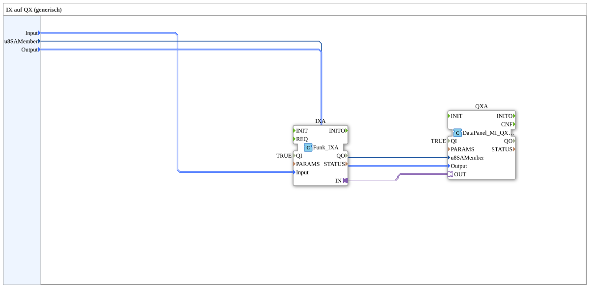

Here is the documentation for exercise `Uebung_003b2_sub_AX`, based on the provided XML content.

# Exercise_003b2_sub_AX: IX to QX (generic)



*(Placeholder for exercise image, if available)*

* * * * * * * * * *

## Introduction

The sub-application `Uebung_003b2_sub_AX` serves as a generic building block to map an input (IX) directly to an output (QX). It acts as a link between radio inputs (`Funk::io::DI`) and DataPanel outputs (`DataPanel::io::MI::DQ`). Its primary purpose is to forward a signal from a defined input source to a defined output destination via an adapter connection.


## Function Blocks (FBs) Used

This sub-application encapsulates the logic for signal forwarding. The internal components and their configuration are described below.


``` ### Sub-Blocks: Exercise_003b2_sub_AX

- **Type**: SubAppType
- **Internal Function Blocks Used**:

- **QXA**: `DataPanel::io::MI::DQ::DataPanel_MI_QXA`

- Parameter: `QI` = `TRUE` (Block is active)

- Data input: `u8SAMember` (connected to external variable `u8SAMember`)

- Data input: `Output` (connected to external variable `Output`)

- Adapter input: `OUT` (connected to `IXA.IN`)

- **IXA**: `Funk::io::DI::Funk_IXA`

- Parameter: `QI` = `TRUE` (Block is active)

- Parameter: `PARAMS` = `""` (Empty string, may be hidden)

- Data input: `Input` (connected to external variable `Input`)

- Adapter output: `IN` (connected to `QXA.OUT`)

- **Functionality**:

The sub-block accepts configuration data for one input and one output. The internal function block `IXA` reads the state of the physical input (defined by the variable `Input`). This state is not passed on as a simple Boolean signal, but rather via an adapter connection (`Connection`) directly to the output function block `QXA`. The `QXA` function block then controls the physical output (defined by `Output` and `u8SAMember`) accordingly.


This signal is not transmitted as a simple Boolean signal, but rather via an adapter connection (`Connection`). ## Program Flow and Connections

The flow within this module is purely signal-driven and serves for hardware abstraction:

1. **Initialization**: The parameter `QI = TRUE` permanently activates both internal driver modules (`IXA` and `QXA`).

2. **Input Assignment**:

- The input `Input` (type: `Funk_DI_S`) determines which wireless switch or button (e.g., DigitalInput_Key_01) is to be monitored.

- This information is passed to the `IXA` module.

3. **Signal Processing (Adapter)**:

- No logical operation (such as AND/OR) takes place at the bit level in the visible network.

- Instead, an adapter connection exists from `IXA.IN` to `QXA.OUT`. This indicates that the status object flow is routed directly from the input driver to the output driver.

4. **Output Assignment**:

- The node input (Node SA 224..239) is specified via the input `u8SAMember` (Type: `USINT`).

- The physical output (e.g., DigitalOutput_1A..8B) is determined via the input `Output` (Type: `DataPanel_MI_DO_S`).

- The `QXA` module uses this information to write the signal received via the adapter to the hardware.


**Interfaces:**

- **Input**: Identifies the digital input.

- **u8SAMember**: Identifies the node address.

- **Output**: Identifies the digital output.

## Summary

The `Uebung_003b2_sub_AX` is a modular component for direct signal pass-through. It simplifies application development by hiding the complexity of the driver components (`Funk_IXA` and `DataPanel_MI_QXA`) and their adapter connections. The user only needs to provide the hardware addresses for the input and output to the sub-application to establish a functional one-to-one connection.