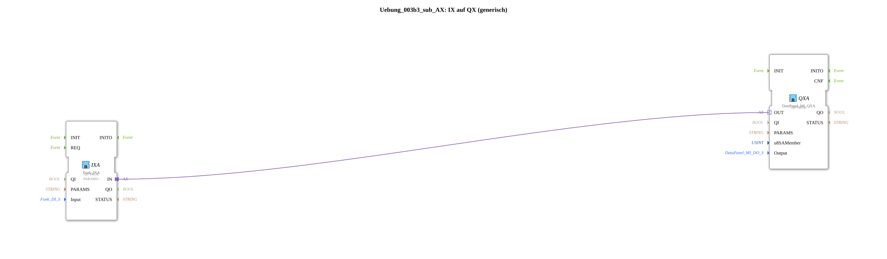

Here is the documentation for the exercise based on the provided XML file:
# Exercise_003b3_sub_AX: IX to QX (generic)

* * * * * * * * * *
## Introduction
This exercise describes a sub-application (`SubAppType`) that establishes a generic connection between a digital input (IX) and a digital output (QX). The function block acts as a bridge to forward signals from an input module (e.g., a wireless switch) directly to an output module (e.g., a data panel).

## Function Blocks Used

In this sub-application, specific function blocks are instantiated and linked together to implement the signal forwarding.

### Sub-Blocks: IXA
- **Type**: `Funk::io::DI::Funk_IXA`
- **Internal Function Blocks Used**:
- **Block Name**: IXA
- **Parameters**:
- `QI` = `TRUE`
- `PARAMS` = `""` (Attribute: Visible = false)
- **Data Input**:
- `Input` (Connected to the SubApp input `Input`)
- **Functionality**:

This block represents the input side of the adapter connection. It receives the input configuration (`Input`) and provides the interface for the input signal.

### Sub-Blocks: QXA
- **Type**: `DataPanel::io::MI::DQ::DataPanel_MI_QXA`
- **Internal Function Blocks Used**:
- **Block Name**: QXA
- **Parameters**:
- `QI` = `TRUE`
- **Data Input**:
- `u8SAMember` (Connected to the SubApp input `u8SAMember`)
- `Output` (Connected to the SubApp input `Output`)
- **Functionality**:

This block represents the output page. It receives the address (`u8SAMember`) and the output configuration (`Output`) for the DataPanel and controls the corresponding physical output.

## Program Flow and Connections

The logic of this sub-application is based on the direct transmission of signals via adapter connections.

1. **Interface Definition**:

- **Input**: Defines the source of the signal (e.g., `DigitalInput_Key_01`).
- **u8SAMember**: Determines the network node (Node SA 224..239) for the output module.
- **Output**: Defines the specific output on the DataPanel (e.g., `DigitalOutput_1A..8B`).

2. **Data Flow**:

- The configuration data is forwarded directly from the inputs of the sub-application to the internal function blocks `IXA` and `QXA`.

3. **Signal Flow (Adapter)**:

- There is a direct **adapter connection** between `IXA.IN` and `QXA.OUT`.
- This connection maps the logical state of the input directly to the output. When the defined input is active, the corresponding output on the DataPanel is switched.

This structure enables clean encapsulation of the I/O mapping, allowing this logic to be easily reused in higher-level applications.

## Summary

The `Uebung_003b3_sub_AX` is a generic interconnect that maps a digital radio input to a digital DataPanel output. Utilizing adapter technology and configurable inputs, the interconnect offers a flexible way to directly link hardware I/Os without complex logic programming.

## 🛠️ Related Exercises
* [Exercise_003b3_AX](Uebung_003b3_AX.md)]
