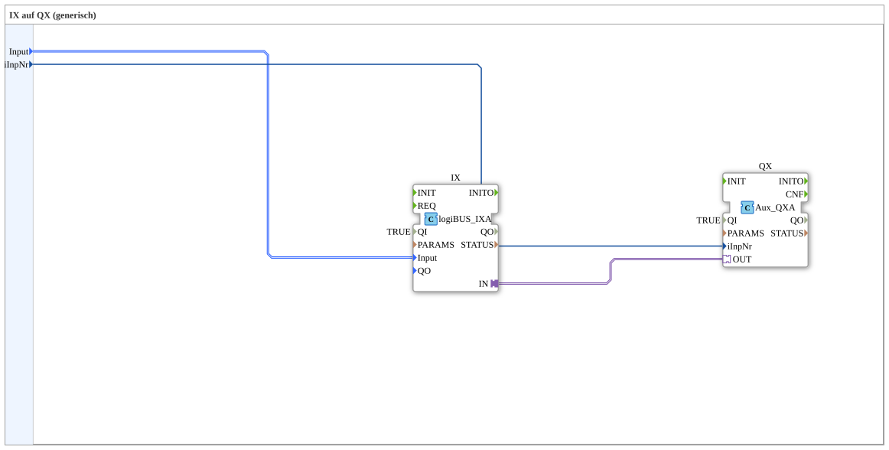

Here is the documentation for the sub-application `Uebung_003c_sub_AX` based on the provided data.
# Exercise_003c_sub_AX: IX to QX (generic)
<Bild der Übung, falls vorhanden>

* * * * * * * * * *
## Introduction
The sub-application **Exercise_003c_sub_AX** serves as a generic building block for connecting a digital input (IX) to an auxiliary output (QX). It functions as an interface to map signals from the LogiBUS system to the ISOBUS auxiliary system, taking into account a specific input number (`iInpNr`).

## Function Blocks (FBs) Used

In this sub-application, specific function blocks are interconnected to implement signal forwarding.

### Sub-Function Blocks: Internal Network Components
This sub-application consists internally of two main components connected via adapters and data lines.

- **Internal FBs Used**:
- **Function Block Name**: `IX`
- **Type**: `logiBUS::io::DI::logiBUS_IXA`
- **Description**: Serves as an interface for the digital input.
- **Parameters**:
- `QI` = `TRUE` (Block is active)
- `PARAMS` = `` (Invisible/Empty)
- **Data Output/Input**:
- `Input`: Receives the input signal of the sub-application (`Input`).
- **Adapter**:
- `IN`: Connected to the adapter input of `QX`.
- **Block Name**: `QX`
- **Type**: `isobus::UT::io::Auxiliary::OUT::Aux_QXA`
- **Description**: Represents the auxiliary output.
- **Parameters**:
- `QI` = `TRUE` (Block is active)
- **Data Output/Input**:
- `iInpNr`: Receives the index number from the sub-application (`iInpNr`).
- **Adapter**:
- `OUT`: Receives the connection from the adapter output of `IX`.
- **Functionality**:

The block `IX` receives the physical input signal (`logiBUS_DI_S`). The state is passed directly to the function block `QX` via an adapter connection (`Connection`). The function block `QX` additionally uses the input `iInpNr` to assign the signal to the correct auxiliary index.

## Program Flow and Connections

The flow within this sub-application is linear and event-driven via the adapter connections:

1. **Input Signal**: A `Input` (of type `logiBUS_DI_S`) and a number `iInpNr` (of type `USINT`) are passed via the sub-application's interface.

2. **Processing in IX**: The internal block `IX` is supplied with `Input`. Since `QI` is set to `TRUE`, this block is permanently active.

3. **Adapter Communication**: An adapter connection exists between `IX.IN` and `QX.OUT`. This means that the logical connection and data exchange between the LogiBUS input and the ISOBUS auxiliary output are abstracted here.

4. **QX Configuration**: The `QX` block receives information from `iInpNr` specifying which auxiliary input in the pool should be addressed (e.g., the first, second, etc.).

**Learning Objectives and Application:**

This exercise illustrates the encapsulation of logic in sub-applications (`SubAppType`). It demonstrates how to link different bus systems (LogiBUS and ISOBUS Auxiliary) within 4diac using adapter connections, without having to rebuild the internal complexity each time. It is a fundamental building block for modularized control software in agricultural technology.

## Summary
The `Uebung_003c_sub_AX` is a reusable module (sub-application) that maps a digital LogiBUS input to an ISOBUS auxiliary output. By configuring the input number (`iInpNr`), the function block can be used flexibly for different inputs, simplifying and improving the clarity of larger control applications.

---

### 🌐 Related topic subpages on ms-muc-docs.de
* [🌐 Eclipse 4diac IDE & color reference on ms-muc-docs.de](https://www.ms-muc-docs.de/iec-61499/eclipse-4diac/)
