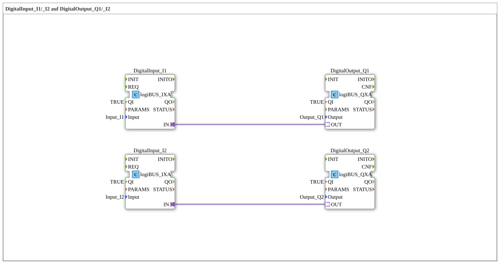

# Exercise_003d_AX: DigitalInput_I1/_I2 to DigitalOutput_Q1/_I2

[(https://notebooklm.google.com/notebook/041f4df4-b729-484d-b786-b6dcdf151961)
This article describes the logiBUS® exercise `Uebung_003d_AX`. This exercise is structurally almost identical to `Uebung_003_AX` and serves to reinforce the understanding of parallel signal paths.
----
## Objective of the Exercise

The objective is to review direct I/O linking using adapter technology. It ensures that the concept of independent data flows is understood.

-----

## Description and Components

[cite_start]The sub-application `Uebung_003d_AX.SUB` connects two inputs to two outputs[cite: 1].

### Function Blocks (FBs)

- **`DigitalInput_I1`** -> **`DigitalOutput_Q1`**
- **`DigitalInput_I2`** -> **`DigitalOutput_Q2`**

The block types are `logiBUS_IXA` and `logiBUS_QXA`, connected via the adapter `AX`.

-----

## Functionality

See `Uebung_003_AX`. The signals are passed through 1:1 and with low latency from the inputs to the outputs.

-----

## Application Example

This exercise can be used as a template for **simple wiring tests**. When putting a new controller into operation, you often upload a "silly" program like this to check if everything is physically connected correctly (press switch -> LED lights up).
