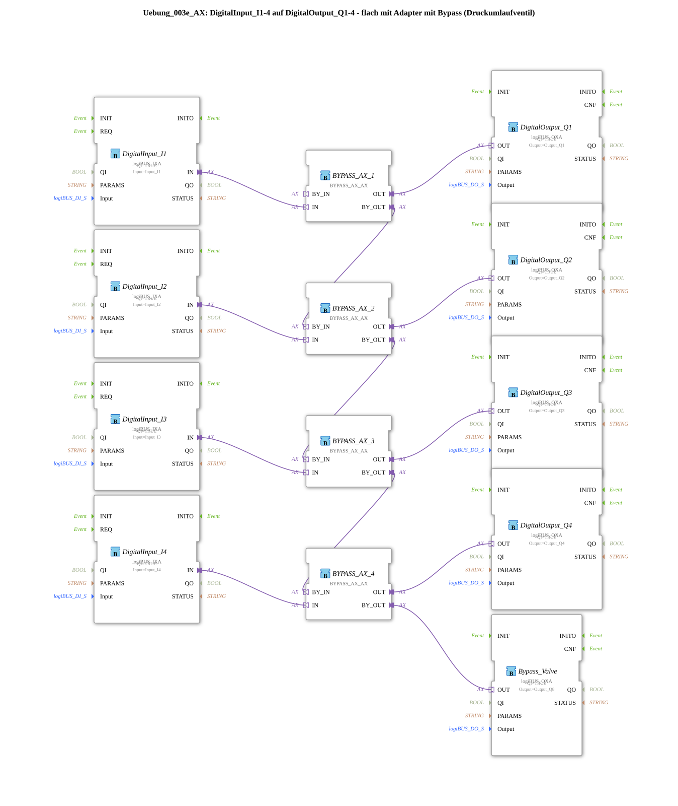

# Exercise_003e_AX: DigitalInput_I1-4 to DigitalOutput_Q1-4 - Flat with Adapter and Bypass (Pressure Relief Valve)

* * * * * * * * * *

## Introduction

This exercise implements a simple pass-through from four digital inputs (I1–I4) to four digital outputs (Q1–Q4). Additionally, a bypass function (pressure relief valve) is integrated, controlled by a common solenoid valve (Output_Q8). The signals are routed through bypass adapters (BYPASS_AX_AX), which provide a main and a bypass path. By cascading the bypass paths, the entire signal flow can be rerouted.

## Function Blocks (FBs) Used

### Sub-Blocks

#### DigitalInput_Ix (x=1..4)

- **Type**: `logiBUS::io::DI::logiBUS_IXA`
- **Parameters**: QI = `TRUE`; Input = `Input_I1` (or `_I2`, `_I3`, `_I4`)
- **Functionality**: Reads the digital input value from the logiBUS I/O system.

#### DigitalOutput_Qx (x=1..4) and Bypass_Valve

- **Type**: `logiBUS::io::DQ::logiBUS_QXA`
- **Parameters**:
- DigitalOutput_Q1..Q4: QI = `TRUE`; Output = `Output_Q1` .. `Output_Q4`
- Bypass_Valve: QI = `TRUE`; Output = `Output_Q8`
- **Function**: Outputs the digital signal to the corresponding logiBUS output.

#### BYPASS_AX_x (x=1..4)

- **Type**: `logiBUS::signalprocessing::bypass::BYPASS_AX_AX`
- **Parameters**: none (pure adapter connections)
- **Event output/input**: none
- **Data output/input**: Adapter ports `IN`, `OUT`, `BY_IN`, `BY_OUT`
- **Functionality**: The function block has two signal paths:
- **Main path**: `IN` → `OUT` – routes the input signal directly to the output.
- **Bypass Path**: `BY_IN` → `BY_OUT` – this path becomes active as soon as the downstream bypass valve opens.

In this exercise, the bypass paths are cascaded, so the bypass of the first block feeds the bypass of the second, and so on. This allows the entire signal flow to be redirected through the bypass chain to the common valve (Bypass_Valve).

## Program Flow and Connections

All connections are made via **adapter connections** (no data or event connections):

- **Main Path**:

Each digital input (`Input_I1` … `Input_I4`) is connected via the `IN` port of the corresponding `BYPASS_AX` block to the `OUT` port, which leads to the corresponding digital output (`Output_Q1` … `Output_Q4`).

- **Bypass Path (cascaded)**:

BYPASS_AX_1.BY_OUT → BYPASS_AX_2.BY_IN
BYPASS_AX_2.BY_OUT → BYPASS_AX_3.BY_IN
BYPASS_AX_3.BY_OUT → BYPASS_AX_4.BY_IN
BYPASS_AX_4.BY_OUT → Bypass_Valve.OUT (Output_Q8)

- **How the Bypass Works**:

When the common bypass valve (`Output_Q8`) is switched, the bypass path opens. The signal is then no longer output via the main outputs (Q1–Q4), but is routed to the valve via the bypass chain. This simulates a pressure relief valve, as found in hydraulic or pneumatic control systems.

## Summary

This exercise teaches how to use **adapter connections** and **bypass logic** in the 4diac IDE. It demonstrates how four digital inputs can be switched to outputs via bypass blocks and how cascading the bypass signals controls a common solenoid valve. The use of logiBUS I/O blocks establishes the connection to real or simulated inputs/outputs.

---

### 🌐 Related topic subpages on ms-muc-docs.de

- [🌐 Eclipse 4diac IDE & Color Reference on ms-muc-docs.de](https://www.ms-muc-docs.de/iec-61499/eclipse-4diac/)

]
