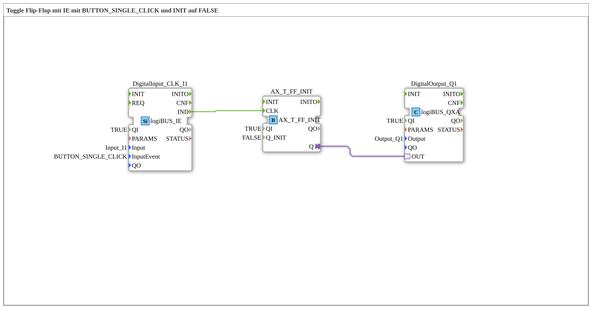

# Exercise_004a10a_AX: Toggle Flip-Flop with IE using BUTTON_SINGLE_CLICK and INIT set to FALSE

* * * * * * * * * *

## Introduction

This exercise implements a toggle flip-flop (T-FF) with an initial value of `FALSE`. The initial state is toggled with each single button press (event `BUTTON_SINGLE_CLICK`). Control is achieved via the logiBUS hardware, using one digital input (`Input_I1`) and one digital output (`Output_Q1`).

## Function Blocks (FBs) Used

### Sub-Blocks

#### Block `DigitalInput_CLK_I1`

- **Type**: `logiBUS::io::DI::logiBUS_IE`
- **Internal FBs Used**: None (Hardware Driver Block)
- **Parameters**:
- `QI` = `TRUE` (Block activation)
- `Input` = `Input_I1` (Physical input channel)
- `InputEvent` = `BUTTON_SINGLE_CLICK` (Triggering event on a single key press)
- **Functionality**: This block detects the state of input `Input_I1` and generates When a key is pressed (event of type `BUTTON_SINGLE_CLICK`), an event occurs at output `IND`. The signal is clocked and passed to the subsequent flip-flop.

#### Function Block `AX_T_FF`

- **Type**: `adapter::events::unidirectional::AX_T_FF_INIT`
- **Internal Function Blocks Used**: None (Standard Flip-Flop Function Block)
- **Parameters**:
- `QI` = `TRUE` (Activate the function block)
- `Q_INIT` = `FALSE` (Initial state of the output)
- **Functionality**: This is a toggle flip-flop. Each time an event is received at input `CLK` (connected to `IND` of the input block), the internal state `Q` is toggled. The output value is provided via the adapter output `Q`. The initial value is `FALSE`, so after the first key press, the state changes to `TRUE`.

#### Function Block `DigitalOutput_Q1`

- **Type**: `logiBUS::io::DQ::logiBUS_QXA`
- **Internal Function Blocks Used**: None (Hardware Driver Block)
- **Parameters**:
- `QI` = `TRUE` (Activation of the function block)
- `Output` = `Output_Q1` (Physical Output Channel)
- **Functionality**: This function block takes the current output value of the flip-flop (via the adapter connection `OUT`) and outputs it to the physical output `Output_Q1`. The value is held continuously until the flip-flop changes its state.

## Program Flow and Connections

1. **Input Event**: The function block `DigitalInput_CLK_I1` waits for a key press at input `Input_I1`. As soon as the event `BUTTON_SINGLE_CLICK` occurs, an event is generated at output `IND`.
2. **Event Connection**: The event `IND` is directly forwarded to the event input `CLK` of the toggle flip-flop `AX_T_FF`.
3. **State Change**: The flip-flop `AX_T_FF` toggles its internal state on every `CLK` event. The current state is present at the adapter output `Q`.
4. **Adapter Connection**: The adapter output `Q` of the flip-flop is connected to the adapter input `OUT` of the output module `DigitalOutput_Q1`. This immediately transfers the new state to the physical output `Output_Q1`.
5. **Initial State**: After a system restart or RESET, the output remains at the initial value `FALSE` (0). With each subsequent key press, the output toggles between `TRUE` (1) and `FALSE` (0).

**Notes on Practical Implementation**:

- This exercise requires a logiBUS IO module with a push button connected to `Input_I1` and an indicator (e.g., LED) connected to `Output_Q1`.
- The behavior is debounced, as the event `BUTTON_SINGLE_CLICK` already provides a filtered edge.
- The function blocks are configured to be automatically active (`QI = TRUE`).

## Summary

This exercise demonstrates the simple implementation of a toggle flip-flop with low-level inputs and outputs. By combining a digital input block with a standard flip-flop and an output block, a practical use case for event control in 4diac is implemented. The focus is on understanding event connections and initializing states.

---

### 🌐 Related topic subpages on ms-muc-docs.de

- [🌐 Eclipse 4diac IDE & Color Reference on ms-muc-docs.de](https://www.ms-muc-docs.de/iec-61499/eclipse-4diac/)
