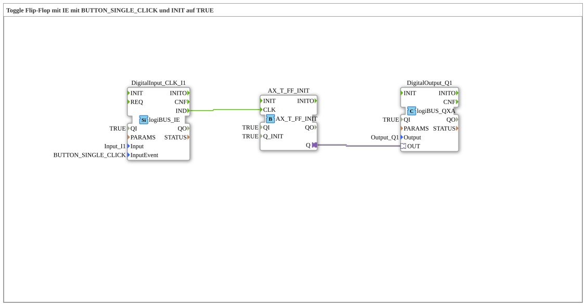

# Exercise_004a10b_AX: Toggle Flip-Flop with IE using BUTTON_SINGLE_CLICK and INIT set to TRUE



* * * * * * * * * *

## Introduction

This exercise implements an asynchronous toggle flip-flop (T-FF) using a logiBUS input block with the event `BUTTON_SINGLE_CLICK` and a logiBUS output block. The function block is initially set to `TRUE` – the output is enabled immediately after startup. Pressing the input `I1` clears the output; another press enables it again (toggle behavior).


## Function Blocks (FBs) Used

- **DigitalInput_CLK_I1** – Type: `logiBUS::io::DI::logiBUS_IE`

- Parameters:

- `QI` = `TRUE` (Block active)

- `Input` = `Input_I1` (Hardware input channel)

- `InputEvent` = `BUTTON_SINGLE_CLICK` (Event on short key press)

- Event output: `IND` (triggered on a valid key press)

- **Function**: Generates an event at the output when a single key press is applied to the physical input `I1` `IND`

- **AX_T_FF** – Type: `adapter::events::unidirectional::AX_T_FF_INIT`

- Parameters:

- `QI` = `TRUE` (Active function block)

- `Q_INIT` = `TRUE` (Initial output value)

- Event input: `CLK` (Clock signal for toggling)

- Adapter output: `Q` (Contains both the event and the data value)

- **Function**: Implements a toggle flip-flop (T-FF). The internal state is toggled on each event at the `CLK` input. The initial state is set by `Q_INIT`. The output `Q` transmits the current state via an adapter connection.

- **DigitalOutput_Q1** – Type: `logiBUS::io::DQ::logiBUS_QXA`

- Parameters:

- `QI` = `TRUE` (Active function block)

- `Output` = `Output_Q1` (Hardware output channel)

- Adapter input: `OUT` (Receives the state via an adapter connection)

- **Function**: Sets the physical output `Q1` to the value received via the adapter connection.


## Program Flow and Connections

1. **Startup Behavior**: The function block `AX_T_FF` has `Q_INIT = TRUE`. This means that output `Q` is active immediately after startup. The value is then passed to the output function block via the adapter connection `AX_T_FF.Q → DigitalOutput_Q1.OUT`, so that the physical output `Q1` is immediately switched on – this is indicated by the comment "ON right at the start!".

2. **Toggle Flow**:

- If the button on `I1` is briefly pressed, `DigitalInput_CLK_I1` generates an event at output `IND`.

- This event is forwarded to the clock input of the T-FF via the event connection `DigitalInput_CLK_I1.IND → AX_T_FF.CLK`.

- The T-FF then toggles its internal state: `TRUE` becomes `FALSE` (or vice versa).

- The new state is transmitted to the output module via the adapter connection, which then sets the physical output accordingly.

3. **Repeated Pressing**: Each subsequent press of `BUTTON_SINGLE_CLICK` triggers another toggle, so the output switches back and forth between `TRUE` and `FALSE`.


**Connection Overview**:

- **Event Connection**: `DigitalInput_CLK_I1.IND` → `AX_T_FF.CLK`
- **Adapter Connection**: `AX_T_FF.Q` → `DigitalOutput_Q1.OUT`

## Summary

This exercise demonstrates the construction of a toggle flip-flop with an initial state (`TRUE`). The input component responds only to a single key press (`BUTTON_SINGLE_CLICK`), thus preventing bounce or multiple triggering. The toggle flip-flop is used as a pre-built adapter component (`AX_T_FF_INIT`), which combines both the switching mechanism and the initialization. The adapter connection between the toggle flip-flop and the output simplifies the coupling of event and data flows.


``` After startup, the output lamp `Q1` lights up immediately. Each button press toggles it – a simple and robust on/off function.