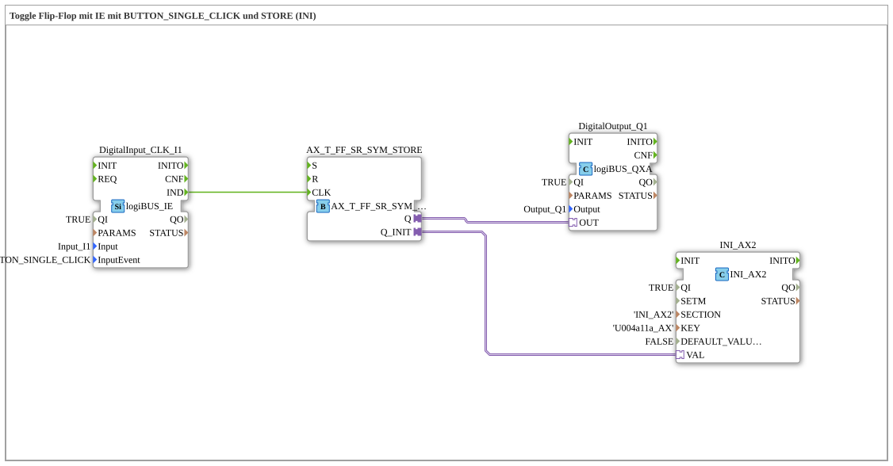

# Exercise_004a11a_AX: Toggle Flip-Flop with IE using BUTTON_SINGLE_CLICK and STORE (INI)

* * * * * * * * * *
## Introduction
This exercise implements a toggle flip-flop (T flip-flop) to control a digital output with a single button press. The last output state is automatically loaded from non-volatile memory and retained when the application starts. This ensures that the switching state is preserved even after a restart. Input is via a debouncing push button that triggers a **BUTTON_SINGLE_CLICK** event.
## Function Blocks Used (FBs)

The subapplication uses the following predefined function blocks:

- **DigitalInput_CLK_I1** (Type `logiBUS::io::DI::logiBUS_IE`)

Digital input that generates the event `IND` upon a single key press. Parameters: `QI = TRUE`, `Input = Input_I1`, `InputEvent = BUTTON_SINGLE_CLICK`.

- **AX_T_FF** (Type `adapter::events::unidirectional::AX_T_FF_SR_SYM_STORE`)

Adapter block of a toggle flip-flop with a balanced SR input and integrated memory function. The flip-flop changes its output state (`Q`) with each rising pulse at the clock input (`CLK`). The initial state is loaded from a memory chip via the adapter port `Q_INIT`.

- **DigitalOutput_Q1** (Type `logiBUS::io::DQ::logiBUS_QXA`)

Digital output for controlling a load (e.g., a lamp or relay). Parameters: `QI = TRUE`, `Output = Output_Q1`.

- **INI_AX2** (Type `eclipse4diac::storage::INI_AX2`)

Memory chip for reading the stored state from an INI file (or similar persistent medium). Parameters: `QI = TRUE`, `SECTION = 'INI_AX2'`, `KEY = 'U004a11a_AX'`, `DEFAULT_VALUE = FALSE`. At startup, this function block returns the last stored output value.

## Program Flow and Connections

The subapplication has no dedicated input/output interfaces; all connections are implemented internally. The process is divided into two phases:

1. **Initialization Phase (Start)**

- The function block `INI_AX2` is activated and reads the value stored under the key `U004a11a_AX` from the INI file.
- This value is then passed to the flip-flop via the adapter connection `AX_T_FF.Q_INIT → INI_AX2.VAL`, which sets its internal state accordingly.
- The flip-flop then passes this state to the output via the adapter connection `AX_T_FF.Q → DigitalOutput_Q1.OUT`.

2. **Operating Phase (Repeated Key Presses)**

- With each key press at input `Input_I1`, the function block `DigitalInput_CLK_I1` generates the event `IND`.
- This event is passed to the flip-flop as a clock signal via the event connection `DigitalInput_CLK_I1.IND → AX_T_FF.CLK`.
- The flip-flop then changes its state (from `TRUE` to `FALSE` or vice versa).
- The new state is then passed to output `DigitalOutput_Q1` via the adapter connection and simultaneously stored in the memory block (implicitly through the adapter).

A comment on the network indicates that the last state must be loaded at the beginning.

```
## Summary

This exercise demonstrates the combination of a debounced push-button input with a memory toggle flip-flop. Of particular importance is the restoration of the last output state after a restart – achieved through the use of an INI memory chip. This makes the circuit suitable for applications where the switching state must be retained even after a power interruption, e.g., for ON/OFF push buttons in controllers.

`` **Learning Objectives:**

- Understanding toggle-flip-flop behavior
- Working with event-driven inputs (BUTTON_SINGLE_CLICK)
- Initializing states from persistent memory
- Adapter connections between function blocks in the 4diac IDE

---

### 🌐 Relevant topic subpages on ms-muc-docs.de
* [🌐 Eclipse 4diac IDE & color reference on ms-muc-docs.de](https://www.ms-muc-docs.de/iec-61499/eclipse-4diac/)
