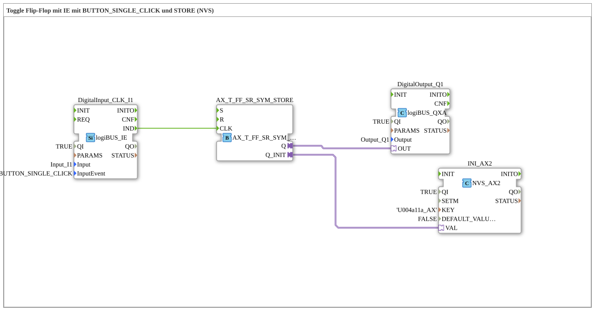

# Exercise_004a11b_AX: Toggle Flip-Flop with IE using BUTTON_SINGLE_CLICK and STORE (NVS)



* * * * * * * * * *

## Introduction

This exercise implements a **toggle flip-flop** (T-FF) with a digital input (logiBUS DI) triggered by the event `BUTTON_SINGLE_CLICK`. The flip-flop's current state is stored in non-volatile memory (NVS) and restored upon startup. This ensures the initial state is retained even after a restart.

This exercise demonstrates the combination of event-driven logic (T-FF) with persistent data storage.

## Function Blocks Used (FBs)

This exercise consists of a total of four function blocks connected in a sub-application network. There are no other embedded sub-blocks.


- **DigitalInput_CLK_I1** (Type: `logiBUS_IE`)

- Parameters:

- `QI` = 1 (active)

- `Input` = `Input_I1` (physical DI)

- `InputEvent` = `BUTTON_SINGLE_CLICK`

- Function: This function block awaits a button press on the digital input. Each rising edge (single click) generates an event at output `IND`.

- **AX_T_FF** (Type: `AX_T_FF_SR_SYM_STORE`)

- Parameters: None

- Function: A T flip-flop with set/reset functionality and memory capability.

The input `CLK` (Event) toggles the internal state on each event.


``` Adapter outputs:

- `Q` – current output state (passed on to digital output)

- `Q_INIT` – used to initialize the flip-flop with a stored value (via NVS)

- **INI_AX2** (Type: `NVS_AX2`)

- Parameters:

- `QI` = 1 (active)

- `KEY` = `U004a11a_AX`

- `DEFAULT_VALUE` = 0 (FALSE)

- Function: Reads the value stored under the key `U004a11a_AX` from the NVS (non-volatile memory) at startup.

The read value is provided at the adapter output `VAL`. If no value is yet stored, `DEFAULT_VALUE` (FALSE) is output.

- **DigitalOutput_Q1** (Type: `logiBUS_QXA`)

- Parameters:

- `QI` = 1 (active)

- `Output` = `Output_Q1` (physical DO)

- Function: The function block outputs the value present at the adapter input `OUT` directly to the digital output `Q1`.


## Program Flow and Connections

The connections between the components define the flow:

1. **Input Event**

When a key is pressed at input I1, `DigitalInput_CLK_I1` generates an event at its output `IND`.

2. **Toggle Flip-Flop**

This event is forwarded directly to the input `CLK` of the toggle flip-flop `AX_T_FF` via an **event connection**. Each event toggles the internal state of the flip-flop.

3. **Output**

The current output state of the toggle flip-flop (`Q`) is transferred to the input `OUT` of the digital output `DigitalOutput_Q1` via an **adapter connection**. Thus, the toggled state becomes visible on the physical output Q1.

4. **Storage and Initialization**

At startup, the function block `INI_AX2` reads the stored value from the NVS and makes it available at its adapter output `VAL`.

This value is passed via an adapter connection to the initialization input `Q_INIT` of the T-FF. This sets the flip-flop to the last stored state at startup (see the network comment: "Load last state at startup!").

*Note:* The storage of the current state back into the NVS is likely handled internally by the T-FF or another function block; in the network diagram shown, the storage is not visible as a separate function block.


*Note:* ## Summary

This exercise illustrates:

- Generating events using a digital button with `BUTTON_SINGLE_CLICK`.

- Toggles a Z-state using a T flip-flop.

- Persistently storing the state in non-volatile memory (NVS) and restoring it after a restart.

- Constructing a simple event-driven logic circuit with combined inputs/outputs (DI/DO).

This lays the foundation for using T flip-flops in combination with NVS storage for typical applications such as switching outputs on and off with state retention.