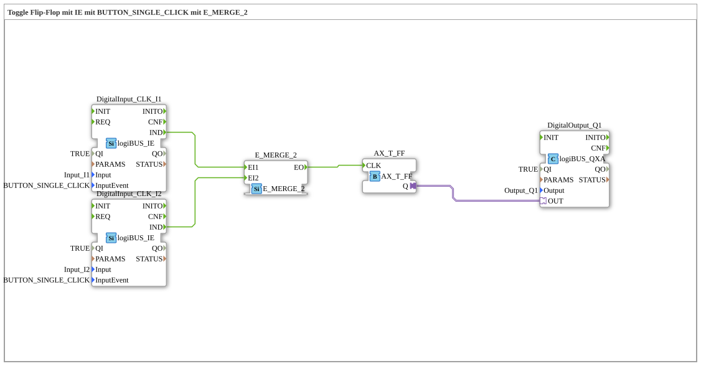

# Exercise_004a2_2_AX: Toggle Flip-Flop with IE using BUTTON_SINGLE_CLICK with E_MERGE_2



* * * * * * * * * *
## Introduction

This exercise implements a toggle flip-flop (T-FF) that is switched by two independent pushbuttons (inputs I1 and I2). Each pushbutton triggers a "BUTTON_SINGLE_CLICK" event. The two events are combined using a `E_MERGE_2` function block and serve as the clock signal for the T-FF. The output of the T-FF controls a digital output (Q1).


``` ## Function Blocks Used (FBs)

- **DigitalOutput_Q1**

- **Type**: `logiBUS::io::DQ::logiBUS_QXA`

- **Parameters**:

- `QI` = TRUE

- `PARAMS` = ""

- `Output` = `Output_Q1`

- **Description**: Provides the digital output Q1. The output value is set via the adapter input.


- **DigitalInput_CLK_I1**

- **Type**: `logiBUS::io::DI::logiBUS_IE`

- **Parameters**:

- `QI` = TRUE

- `PARAMS` = ""

- `Input` = `Input_I1`

- `InputEvent` = `BUTTON_SINGLE_CLICK`

- **Description**: Reads the digital input I1 and generates an event `IND` on a short key press (single click).


``` - **DigitalInput_CLK_I2**

- **Type**: `logiBUS::io::DI::logiBUS_IE`

- **Parameters**:

- `QI` = TRUE

- `PARAMS` = ""

- `Input` = `Input_I2`

- `InputEvent` = `BUTTON_SINGLE_CLICK`

- **Description**: Reads the digital input I2 and generates an event `IND` when a key is briefly pressed.


``` - **E_MERGE_2**

- **Type**: `iec61499::events::E_MERGE_2`

- **Parameters**: None

- **Description**: Combines two event inputs (EI1, EI2) into a single event output (EO). As soon as an event occurs at either input, it is passed to the output.

- **AX_T_FF**

- **Type**: `adapter::events::unidirectional::AX_T_FF`

- **Parameters**: None

- **Description**: A toggle flip-flop as an adapter. With each event at input `CLK`, output `Q` toggles its state (0→1, 1→0).

## Program Flow and Connections

The system operates in an event-driven manner. As soon as the user briefly presses the button at input I1 or I2, the corresponding `DigitalInput` block generates an event `IND`. These two events are combined via the `E_MERGE_2` block – regardless of which button was pressed, the `E_MERGE_2` triggers an event at its output `EO`. This event is then directly forwarded to the clock input `CLK` of the T-FF (`AX_T_FF`). The T-FF toggles its output state with each incoming event. The current state `Q` of the T-FF is transferred via an adapter connection to the digital output `DigitalOutput_Q1`, which controls the physical output Q1.


``` **Connection Overview**:

- Event Connections:

- `DigitalInput_CLK_I1.IND` → `E_MERGE_2.EI1`

- `DigitalInput_CLK_I2.IND` → `E_MERGE_2.EI2`

- `E_MERGE_2.EO` → `AX_T_FF.CLK`

- Adapter Connections:

- `AX_T_FF.Q` → `DigitalOutput_Q1.OUT`

## Summary

This exercise demonstrates the combination of two event sources (buttons) with a `E_MERGE_2` module to generate a common clock signal for a toggle flip-flop. The flip-flop's output state can be toggled by pressing either button. This is a basic example of event-driven logic in 4diac and the use of adaptable I/O blocks from the logiBUS library.

---

### 🌐 Related topic subpages on ms-muc-docs.de

* [🌐 Eclipse 4diac IDE & Color Reference on ms-muc-docs.de](https://www.ms-muc-docs.de/iec-61499/eclipse-4diac/)

]