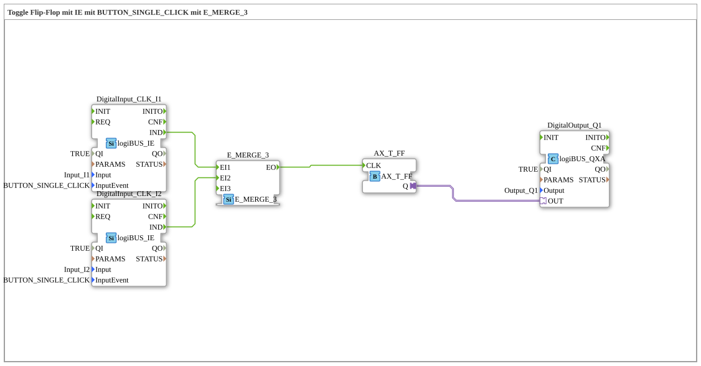

# Exercise_004a2_3_AX: Toggle Flip-Flop with IE using BUTTON_SINGLE_CLICK with E_MERGE_3

* * * * * * * * * *
## Introduction
This exercise implements a **Toggle Flip-Flop** (T-FF) controlled by two separate pushbuttons (inputs I1 and I2). The pushbuttons are configured as **BUTTON_SINGLE_CLICK**, meaning each button press generates exactly one event. The events from both pushbuttons are combined using an **E_MERGE_3** block and sent to the clock input (CLK) of the T-FF. The output Q of the T-FF switches a digital output (Q1). The switching behavior: Each button press (regardless of which button) toggles the output state.
This exercise demonstrates the combination of hardware input blocks with event processing and an adapter-based flip-flop.

## Function Blocks Used

The following function blocks are used in the network:

- **DigitalOutput_Q1** – Type: `logiBUS::io::DQ::logiBUS_QXA`
- Parameters: `QI` = `TRUE`, `Output` = `Output_Q1`
- Function: Provides the digital output Q1. The output value is set via the adapter input `OUT`.

`` - **DigitalInput_CLK_I1** – Type: `logiBUS::io::DI::logiBUS_IE`

- Parameters: `QI` = `TRUE`, `Input` = `Input_I1`, `InputEvent` = `BUTTON_SINGLE_CLICK`
- Task: Detects the button on I1. Each button press triggers the event `BUTTON_SINGLE_CLICK` and sends an IND event to the output.
- **DigitalInput_CLK_I2** – Type: `logiBUS::io::DI::logiBUS_IE`
- Parameters: `QI` = `TRUE`, `Input` = `Input_I2`, `InputEvent` = `BUTTON_SINGLE_CLICK`
- Function: Detects the button press at I2. Same functionality as the function block for I1.
- **AX_T_FF** – Type: `adapter::events::unidirectional::AX_T_FF`
- Parameters: none additional
- Function: Adapter function block implementing a T flip-flop. The internal state is toggled on each event at the CLK input. The output Q (adapter) displays the current state.
- **E_MERGE_3** – Type: `iec61499::events::E_MERGE_3`
- Parameters: none additional
- Task: Event merging. The three event inputs (EI1, EI2, EI3) are logically ORed; for each incoming event at any of the inputs, an event is output at output EO. In this exercise, only two inputs (EI1, EI2) are used; the third remains unconnected.

## Program Flow and Connections

The wiring works as follows:

1. **Input Events**: The two DigitalInput modules generate an IND event (button press detected) when the respective button is pressed.

2. **Event Merge**: The IND events are merged into `E_MERGE_3`:

- `DigitalInput_CLK_I1.IND` → `E_MERGE_3.EI1`
- `DigitalInput_CLK_I2.IND` → `E_MERGE_3.EI2`
- The third input (EI3) is not connected (this is permitted according to the comment).

3. **Clock for the Flip-Flop**: The merged event (`E_MERGE_3.EO`) is connected to the CLK input of the T-FF (`AX_T_FF.CLK`). Each key press therefore triggers a clock event.

4. **Output**: The adapter output `AX_T_FF.Q` is connected to the input `OUT` of the DigitalOutput module. The flip-flop's state is directly output to the digital output Q1.

**Behavior**: Each time a button is pressed (I1 or I2), Q1 toggles its state (from 0 → 1 or 1 → 0). This corresponds to a typical toggle flip-flop.

## Summary

This exercise demonstrates how to implement a **toggle flip-flop** using an adapter module (`AX_T_FF`) and event processing. Two buttons are configured via `BUTTON_SINGLE_CLICK`, and their events are combined using `E_MERGE_3`, so that each button press toggles the flip-flop independently of the others. This is a basic circuit for event control and state storage using 4diac and logiBUS hardware.

---

### 🌐 Related topic subpages on ms-muc-docs.de
* [🌐 Eclipse 4diac IDE & Color Reference on ms-muc-docs.de](https://www.ms-muc-docs.de/iec-61499/eclipse-4diac/)

]
