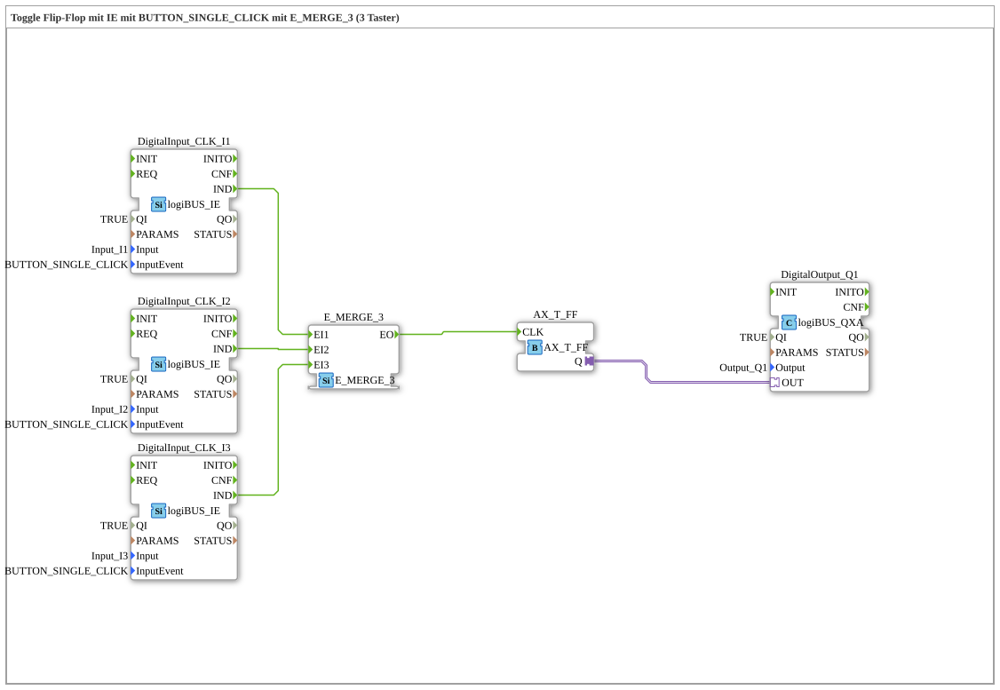

# Exercise_004a2_3b_AX: Toggle Flip-Flop with IE using BUTTON_SINGLE_CLICK with E_MERGE_3 (3 Buttons)

* * * * * * * * * *
## Introduction
This exercise implements a toggle flip-flop controlled by three buttons (BUTTON_SINGLE_CLICK). The button events are combined into a single clock signal using E_MERGE_3. The flip-flop toggles its initial state with each button press and outputs the result to a digital output.

## Function Blocks (FBs) Used

### Sub-Block: DigitalInput_CLK_I1 (Type: `logiBUS_IE`)
- **Type**: `logiBUS::io::DI::logiBUS_IE`
- **Parameters**:
- `QI` = `TRUE`
- `Input` = `Input_I1`
- `InputEvent` = `BUTTON_SINGLE_CLICK`
- **Functionality**:

Digital input that triggers an event at its output `IND` when a single key press is placed on channel I1.

### Sub-module: DigitalInput_CLK_I2 (Type: `logiBUS_IE`)
- **Type**: `logiBUS::io::DI::logiBUS_IE`
- **Parameters**:
- `QI` = `TRUE`
- `Input` = `Input_I2`
- `InputEvent` = `BUTTON_SINGLE_CLICK`
- **Functionality**:

Same module as for channel I1, but connected to the second button (Input_I2).

### Sub-module: DigitalInput_CLK_I3 (Type: `logiBUS_IE`)
- **Type**: `logiBUS::io::DI::logiBUS_IE`
- **Parameters**:
- `QI` = `TRUE`
- `Input` = `Input_I3`
- `InputEvent` = `BUTTON_SINGLE_CLICK`
- **Functionality**:

Same module for the third button (Input_I3).

### Sub-module: E_MERGE_3 (Type: `E_MERGE_3`)
- **Type**: `iec61499::events::E_MERGE_3`
- **Parameters**: none
- **Functionality**:

Combines three event inputs (`EI1`, `EI2`, `EI3`) into a single event output (`EO`). As soon as an event arrives at one of the inputs, it is immediately passed on to `EO`.

### Sub-module: AX_T_FF (Type: `AX_T_FF`)
- **Type**: `adapter::events::unidirectional::AX_T_FF`
- **Parameters**: none
- **Functionality**:

Toggle flip-flop. With each event at input `CLK`, the output `Q` toggles between `TRUE` and `FALSE`.

### Sub-module: DigitalOutput_Q1 (Type: `logiBUS_QXA`)
- **Type**: `logiBUS::io::DQ::logiBUS_QXA`
- **Parameters**:
- `QI` = `TRUE`
- `Output` = `Output_Q1`
- **Functionality**:

Digital output. The value received via the adapter input `OUT` is output to the logiBUS channel Q1.

## Program Flow and Connections

The three pushbuttons (I1, I2, I3) are each connected to a `logiBUS_IE`, which generates an event (`BUTTON_SINGLE_CLICK`) with each button press. The event outputs of these three inputs (`DigitalInput_CLK_I1.IND`, `DigitalInput_CLK_I2.IND`, `DigitalInput_CLK_I3.IND`) are connected to the three inputs of `E_MERGE_3` (`EI1`, `EI2`, `EI3`). The merge block forwards each incoming event to its output `EO`. This output is, in turn, connected to the clock input `CLK` of the toggle flip-flop `AX_T_FF`.

The flip-flop changes its output state with each received event. The current state is transferred via the adapter output `Q` to the adapter input `OUT` of the output module `DigitalOutput_Q1` and appears on the digital output `Q1`.

The entire circuit thus implements a **three-button toggle flip-flop**: Each button press – regardless of which button – toggles the output.

### Learning Objectives
- Understanding toggle flip-flop behavior
- Using the event merge block to combine multiple event sources
- Integrating logiBUS inputs and outputs with event triggering
- Building a simple event-driven circuit in 4diac-IDE

### Difficulty Level

Easy – suitable for beginners in IEC 61499 modeling with 4diac-IDE.

### Prerequisites
- Basic understanding of IEC 61499 event and data flows
- Fundamentals of logiBUS configuration (input/output channels)

## Summary

Exercise `Uebung_004a2_3b_AX` demonstrates the construction of a toggle flip-flop controlled by three pushbuttons. The button events are combined into a single clock signal using `E_MERGE_3` and toggle the state of a flip-flop, which is then output via a digital output. This simple example demonstrates fundamental concepts of event-driven programming with function blocks using logiBUS hardware.

---

### 🌐 Related topic subpages on ms-muc-docs.de
* [🌐 Eclipse 4diac IDE & color reference on ms-muc-docs.de](https://www.ms-muc-docs.de/iec-61499/eclipse-4diac/)
