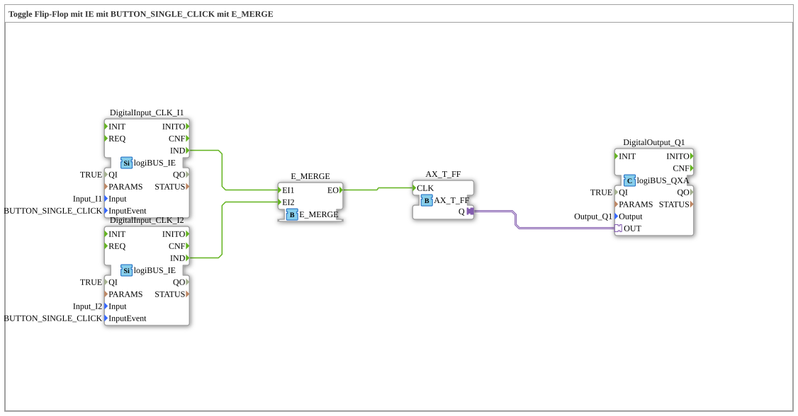

# Exercise_004a2_AX: Toggle Flip-Flop with IE using BUTTON_SINGLE_CLICK with E_MERGE
[](https://notebooklm.google.com/notebook/041f4df4-b729-484d-b786-b6dcdf151961)
This article describes the logiBUS® exercise `Uebung_004a2_AX`. Here, the impulse circuit is extended so that it can be operated by two different pushbuttons. This is achieved by merging the events from the two pushbuttons.
----
## Objective of the Exercise
The objective is to learn how to combine asynchronous event streams. If two event sources (pushbuttons) are to trigger the same process (switching the light), their signals must be merged before they reach the function block.

## Description and Components

[cite_start]The subapplication `Uebung_004a2_AX.SUB` uses a `E_MERGE` function block to route two input events to a flip-flop input[cite: 1].

### Function Blocks (FBs)



* **`DigitalInput_CLK_I1` & `I2`**: Two `logiBUS_IE` function blocks, configured to `BUTTON_SINGLE_CLICK`. [cite_start]They generate events when button 1 or 2 is pressed[cite: 1].
* **`E_MERGE`**: Type `E_MERGE`. [cite_start]This component has two event inputs (`EI1`, `EI2`) and one event output (`EO`). Regardless of which input receives an event, it is immediately forwarded to the corresponding output [cite: 1].
* **`E_T_FF`**: The toggle flip-flop that stores the state.
* **`DigitalOutput_Q1`**: The output for the lamp.

-----

## Functionality

```xml
<EventConnections>
<Connection Source="DigitalInput_CLK_I1.IND" Destination="E_MERGE.EI1"/>
<Connection Source="DigitalInput_CLK_I2.IND" Destination="E_MERGE.EI2"/>
<Connection Source="E_MERGE.EO" Destination="E_T_FF.CLK"/>
</EventConnections>

[cite_start][cite: 1]

1. When button 1 is pressed, `I1` sends an event to `E_MERGE.EI1`. `E_MERGE` forwards it to `EO` -> `E_T_FF` switches the light on and off.

2. When button 2 is pressed, `I2` sends an event to `E_MERGE.EI2`. `E_MERGE` forwards it to `EO` -> `E_T_FF` switches the light on and off.

Thus, the light can be switched on and off using either button.

## Application Example

This corresponds to a **two-way switching circuit in the hallway**: You can turn the light on downstairs and off upstairs (and vice versa). Each button simply toggles the current state, regardless of the current state.
