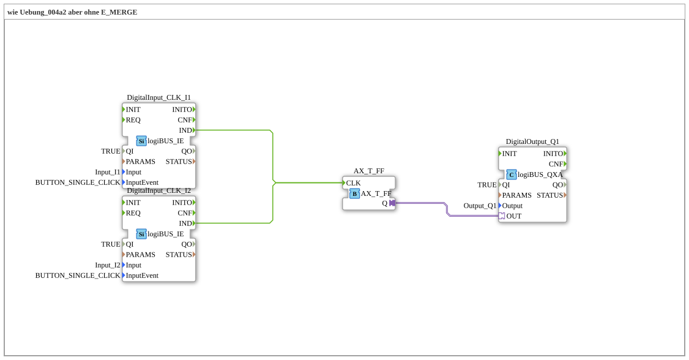

# Exercise_004a3_AX: same as Exercise_004a2 but without E_MERGE

[](https://notebooklm.google.com/notebook/041f4df4-b729-484d-b786-b6dcdf151961)

This article describes the logiBUS® exercise `Uebung_004a3_AX`. This exercise demonstrates a simplification compared to `Uebung_004a2_AX`: In IEC 61499 (and specifically in 4diac), multiple event sources can often be directly connected to the same event input.

----

## Purpose of the Exercise

The goal is to reduce visual complexity. It demonstrates that the explicit `E_MERGE` block can be omitted in many cases because the runtime environment automatically processes incoming events on a port sequentially (implicit OR for events).


-----

## Description and Components

[cite_start]The subapplication `Uebung_004a3_AX.SUB` connects two event sources directly to the clock input of the flip-flop[cite: 1].

### Function Blocks (FBs)



* **`DigitalInput_CLK_I1` & `I2`**: The event generators.

* **`E_T_FF`**: The toggle flip-flop.

* **`DigitalOutput_Q1`**: The output.

The function block `E_MERGE` is intentionally omitted here.

-----

## Functionality


```xml
<EventConnections>
    <Connection Source="DigitalInput_CLK_I1.IND" Destination="E_T_FF.CLK"/>
    <Connection Source="DigitalInput_CLK_I2.IND" Destination="E_T_FF.CLK"/>
</EventConnections>
```


[cite_start][cite: 1]

The functionality is identical to the exercise with `E_MERGE`:

Every incoming event at `E_T_FF.CLK` – regardless of whether it originates from `I1` or `I2` – triggers the execution of the function block. The 4diac IDE and Runtime support these "fan-in" connections for events.

*(Note: This is **not** allowed for data connections! Two data outputs must never write directly to the same data input, as this would lead to conflicts. However, it is common practice for "OR" logic in event triggers.)*

-----

## Application Example

Same example as before (toggle switch), but with more efficient code (fewer blocks, less memory required).


---

### 🌐 Related topic subpages on ms-muc-docs.de

* [🌐 Eclipse 4diac IDE & Color Reference on ms-muc-docs.de](https://www.ms-muc-docs.de/iec-61499/eclipse-4diac/)

]