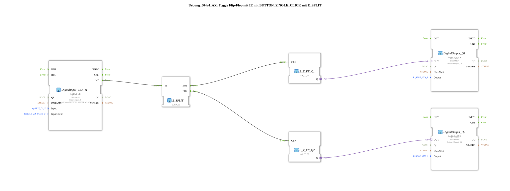

# Exercise_004a4_AX: Toggle Flip-Flop with IE using BUTTON_SINGLE_CLICK with E_SPLIT

[(https://notebooklm.google.com/notebook/041f4df4-b729-484d-b786-b6dcdf151961)
This article describes the logiBUS® exercise `Uebung_004a4_AX`. It demonstrates how a single event can be used to trigger multiple independent processes by using a `E_SPLIT` function block.
-----
## Objective of the Exercise

The objective is to understand sequential event processing. In IEC 61499, an event output can often only be connected to one event input (Fan-Out = 1), or you may want to explicitly control the processing order. The `E_SPLIT` function block receives an input event and fires outputs sequentially.

-----

## Description and Components

[cite_start]The subapplication `Uebung_004a4_AX.SUB` uses a push button to toggle two separate toggle flip-flops[cite: 1].

### Function Blocks (FBs)

- **`DigitalInput_CLK_I1`**: The event generator (push button).
- **`E_SPLIT`**: An event distributor. It has one input `EI` and two outputs `EO1` and `EO2`.
- **`E_T_FF_Q1` & `Q2`**: Two independent flip-flops.
- **`DigitalOutput_Q1` & `Q2`**: Two lamps.

-----

## How it Works

<EventConnections>
<Connection Source="DigitalInput_CLK_I1.IND" Destination="E_SPLIT.EI"/>
<Connection Source="E_SPLIT.EO1" Destination="E_T_FF_Q1.CLK"/>
<Connection Source="E_SPLIT.EO2" Destination="E_T_FF_Q2.CLK"/>
</EventConnections>

[cite_start][cite: 1]

1. A click on button 1 sends an event to `E_SPLIT`.
2. `E_SPLIT` **first** sends an event to `EO1` -> `E_T_FF_Q1` switches.
3. Then (almost simultaneously, but logically afterward), `E_SPLIT` sends an event to `EO2` -> `E_T_FF_Q2` switches.

Both lamps thus switch synchronously, controlled by one button.

*(Note in the code: "Using two T_FFs here is pointless; this is only to show how to use E_SPLIT." - That's correct; both outputs could have been connected to a single FF. This is purely for demonstrating event splitting.)*

-----

## Application Example

**Scene Control**: A "Closing Time" button simultaneously (or sequentially) triggers several actions: switching off the lights (`Q1`) and arming the alarm system (`Q2`). The splitter ensures that both function chains are triggered.
