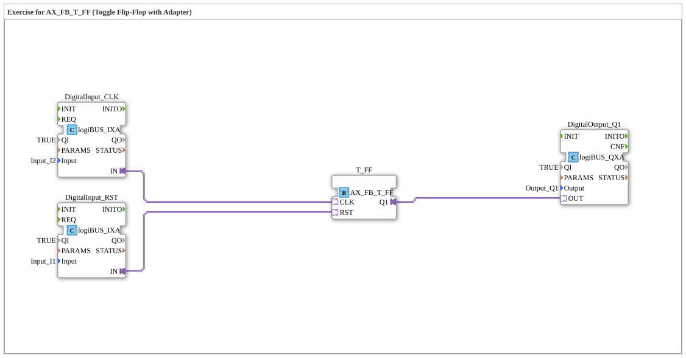

# Exercise_004a4_AX_T: Exercise for AX_FB_T_FF (Toggle Flip-Flop with Adapter)

* * * * * * * * * *

## Introduction

This exercise demonstrates the use of a **toggle flip-flop (AX_FB_T_FF)** with the help of adapters.
A toggle flip-flop changes its output state (Q1) on each positive clock pulse (CLK) and can be set to `FALSE` via the reset input (RST).
The inputs are implemented via two logiBUS digital input modules (Input_I1 and Input_I2), and the output via a logiBUS digital output module (Output_Q1).

## Function Blocks Used (FBs)

The sub-app contains the following function blocks:

- **DigitalInput_RST**
- Type: `logiBUS::io::DI::logiBUS_IXA`
- Parameters: `QI = TRUE`, `Input = Input_I1`
- *Connects the physical input Input_I1 to the RST signal of the flip-flop.*
- **DigitalInput_CLK**
- Type: `logiBUS::io::DI::logiBUS_IXA`
- Parameters: `QI = TRUE`, `Input = Input_I2`
- *Connects the physical input Input_I2 to the clock signal (CLK) of the flip-flop.*
- **T_FF**
- Type: `adapter::bistableElements::AX_FB_T_FF`
- No further parameters.
- *Core of the exercise: A toggle flip-flop that switches the output on each clock cycle.*
- **DigitalOutput_Q1**
- Type: `logiBUS::io::DQ::logiBUS_QXA`
- Parameters: `QI = TRUE`, `Output = Output_Q1`
- *Connects the flip-flop output to the physical output Output_Q1.*

### Sub-Building Blocks

No other SubApp building blocks were used within this exercise.

## Program Flow and Connections

The function blocks are linked via **adapter connections** (not classic event/data connections):

1. **Reset Signal (RST):**

DigitalInput_RST.IN` → `T_FF.RST`

*A signal on input Input_I1 resets the flip-flop (Q1 = FALSE).*

1. **Clock Signal (CLK):**

DigitalInput_CLK.IN` → `T_FF.CLK`
*Each rising edge on Input_I2 toggles output Q1 (from TRUE to FALSE or vice versa).*

1. **Output (Q1):**

T_FF.Q1` → `DigitalOutput_Q1.OUT`
*The current state of the flip-flop is displayed on the physical output Output_Q1 Output.*

**Procedure:**

- As long as no reset is applied, the output changes its state with each clock pulse.
- An active reset (TRue) immediately sets the output to `FALSE` and keeps it there until the reset is removed and a new clock pulse arrives.

## Summary

This exercise teaches the application of a **toggle flip-flop** via adapter connections in the 4diac IDE.

- Learning Objectives:
- Understanding the operation of a toggle flip-flop (AX_FB_T_FF).
- Connecting physical inputs/outputs via logiBUS adapters.
- Creating and testing a simple circuit for changing state with a clock pulse.
- Prerequisites: Basic knowledge of IEC 61499, using adapters, logiBUS integration.

This exercise is suitable as an introduction to sequential logic with memory behavior.

---

### 🌐 Related topic subpages on ms-muc-docs.de

- [🌐 Eclipse 4diac IDE & Color Reference on ms-muc-docs.de](https://www.ms-muc-docs.de/iec-61499/eclipse-4diac/)

]
