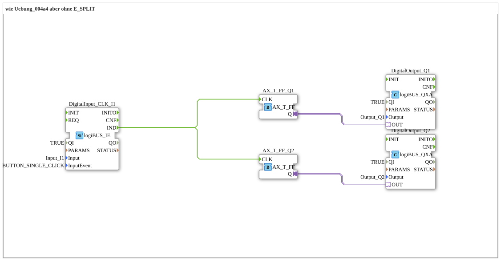

# Exercise_004a5_AX: same as Exercise_004a4 but without E_SPLIT

This article describes the logiBUS® exercise `Uebung_004a5_AX`. Similar to `Uebung_004a3_AX` (Implicit Merge), this exercise demonstrates that an event split is often possible without an explicit function block.
----
## Objective of the Exercise
Demonstration of the "fan-out" capability of event connections in 4diac. A source event can be connected to multiple target events.

-----

## Description and Components

[cite_start]The subapplication `Uebung_004a5_AX.SUB` removes the `E_SPLIT` block from the previous exercise and connects the button directly to both flip-flops[cite: 1].

### Function Blocks (FBs)

* **`DigitalInput_CLK_I1`**: Button.
* **`E_T_FF_Q1` & `Q2`**: Flip-flops.

-----

## Functionality

<EventConnections>
<Connection Source="DigitalInput_CLK_I1.IND" Destination="E_T_FF_Q1.CLK"/>
<Connection Source="DigitalInput_CLK_I1.IND" Destination="E_T_FF_Q2.CLK"/>
</EventConnections>

[cite_start][cite: 1]

When `I1` fires an event, it is distributed to all connected targets. The processing order is not strictly defined for "fan-out" in the IEC 61499 standard (it is implementation-dependent, usually in the order the connection is established). If the order is critical, a `E_SPLIT` **must** be used. If it doesn't matter (as here, where only two lamps need to toggle), a direct connection is sufficient.

-----

## Application Example

Same example as before (central off), but implemented in a more space-efficient way.

---

### 🌐 Related topic subpages on ms-muc-docs.de
* [🌐 Eclipse 4diac IDE & Color Reference on ms-muc-docs.de](https://www.ms-muc-docs.de/iec-61499/eclipse-4diac/)
