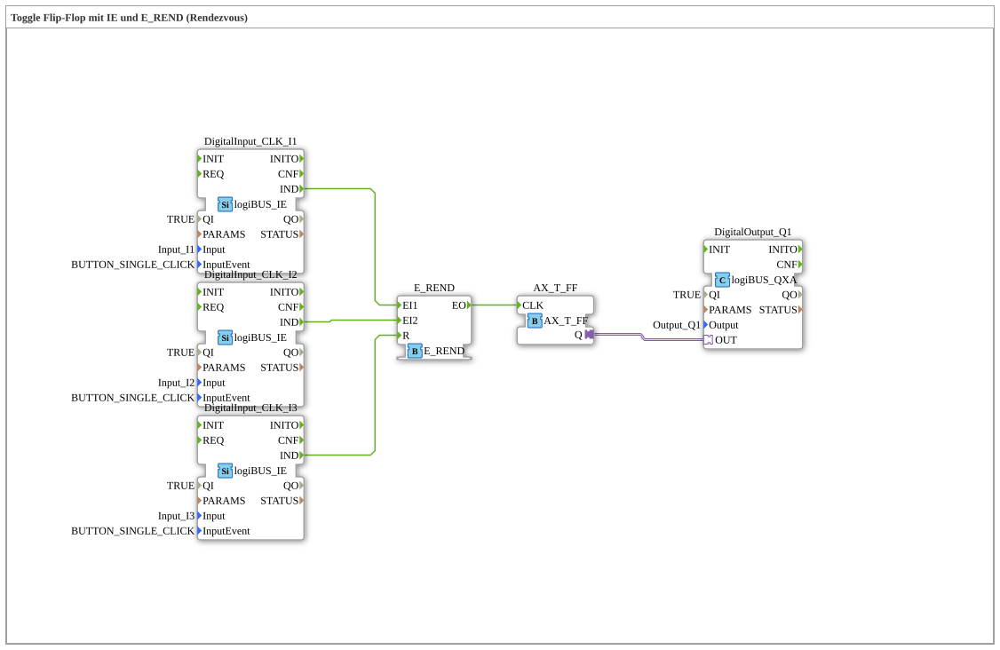

# Exercise_004a6_AX: Toggle Flip-Flop with IE and E_REND (Rendezvous)

This article describes the logiBUS® exercise `Uebung_004a6_AX`. It introduces a more complex event handling pattern: the rendezvous. An event is only passed on when two conditions (events) have occurred.
----
## Objective of the Exercise

Understanding the `E_REND` function block. This function block acts like an "AND" for events. It keeps track of which inputs have already fired and only fires at the output when *all* required inputs have been active at least once. Afterward, it resets.

## Description and Components

[cite_start]The subapplication `Uebung_004a6_AX.SUB` uses `E_REND` to ensure that two buttons have been pressed before the light switches.[cite: 1]

### Function Blocks (FBs)

* **`DigitalInput_CLK_I1` & `I2`**: The two confirmation buttons.
* **`DigitalInput_CLK_I3`**: A reset button.
* **`E_REND`**: The rendezvous block with inputs `EI1`, `EI2`, and a reset button `R`.
* **`E_T_FF`**: The flip-flop.
* **`DigitalOutput_Q1`**: The lamp.

-----

## How it works

<EventConnections>
<Connection Source="DigitalInput_CLK_I1.IND" Destination="E_REND.EI1"/>
<Connection Source="DigitalInput_CLK_I2.IND" Destination="E_REND.EI2"/>
<Connection Source="E_REND.EO" Destination="E_T_FF.CLK"/>
<Connection Source="DigitalInput_CLK_I3.IND" Destination="E_REND.R"/>
</EventConnections>

[cite_start][cite: 1]

1. Pressing only button 1 (`I1`) does nothing at the output. `E_REND` internally registers "EI1 was present."
2. Pressing button 2 (`I2`) then completes the condition (both were present). `E_REND` fires `EO`.
3. The flip-flop toggles, and the lamp changes its state.
4. `E_REND` forgets the status and waits for both events again.
* The reset button (`I3`) can be used to clear the internal marker of `E_REND`, for example, if only button 1 has been pressed and the process needs to be canceled.

----

## Application Example

**Two-Hand Trigger (Sequential)**: A process should only start when operator A presses "Release" AND operator B presses "Start" (the order doesn't matter, but both must press at least once).
