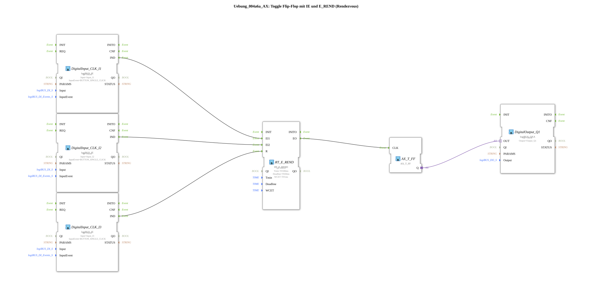

# Exercise_004a6a_AX: Toggle Flip-Flop with IE and E_REND (Rendezvous)

* * * * * * * * * *
## Introduction
This exercise implements a **toggle flip-flop** (changeover switch) using **event inputs** (IE) and a **rendezvous block** (`RT_E_REND`).
The system expects two button events (inputs I1 and I2) that must arrive within a specific time limit (deadline). Only when both events have been synchronized is the flip-flop clocked and the digital output Q1 switched. A third button (I3) serves as a reset for the rendezvous mechanism.
This exercise demonstrates how to handle time-critical event connections, rendezvous synchronization, and simple toggle functions in the 4diac IDE.
...
## Function Blocks Used (FBs)

The SubApp uses the following (sub)blocks:

- **`DigitalInput_CLK_I1`** – Type: `logiBUS::io::DI::logiBUS_IE`
- **Parameters:**
- `QI` = `TRUE`
- `Input` = `Input_I1`
- `InputEvent` = `BUTTON_SINGLE_CLICK`
- **Event Output:** `IND` (sends an event when a button is pressed)
- **Function:** Generates an event as soon as the button at input I1 is pressed once.
- **`DigitalInput_CLK_I2`** – Type: `logiBUS::io::DI::logiBUS_IE`
- **Parameters:**
- `QI` = `TRUE`
- `Input` = `Input_I2`
- `InputEvent` = `BUTTON_SINGLE_CLICK`
- **Event Output:** `IND`
- **Function:** Generates an event when a key is pressed at input I2.
- **`DigitalInput_CLK_I3`** – Type: `logiBUS::io::DI::logiBUS_IE`
- **Parameters:**
- `QI` = `TRUE`
- `Input` = `Input_I3`
- `InputEvent` = `BUTTON_SINGLE_CLICK`
- **Event Output:** `IND`
- **Function:** Generates an event when a key is pressed at input I3 (serves as a reset).
- **`RT_E_REND`** – Type: `eclipse4diac::rtevents::RT_E_REND`
- **Parameters:**
- `QI` = `TRUE`
- `Tmin` = `T#100ms` (minimum event time, not used here)
- `Deadline` = `T#20ms` (maximum time between EI1 and EI2)
- `WCET` = `T#1ms` (worst-case execution time)
- **Event Inputs:** `EI1`, `EI2`, `R` (Reset)
- **Event Output:** `EO`
- **Data Connections:** None
- **Function:** Performs a rendezvous between the events at `EI1` and `EI2`. If both arrive within `Deadline`, `EO` is triggered. The input `R` resets the internal state.

`` - **`AX_T_FF`** – Type: `adapter::events::unidirectional::AX_T_FF`

**Parameters:** None

**Event Input:** `CLK` (Clock Signal)

**Adapter Output:** `Q`

**Function:** Toggle Flip-Flop. Each event at the `CLK` input toggles the state of the output `Q`.

- **`DigitalOutput_Q1`** – Type: `logiBUS::io::DQ::logiBUS_QXA`
- **Parameters:**
- `QI` = `TRUE`
- `Output` = `Output_Q1`
- **Adapter Input:** `OUT` (Control Signal)
- **Function:** Outputs the value of `OUT` on physical output Q1.

## Program Flow and Connections

1. **Event Detection:**

- The three button inputs (`Input_I1`, `Input_I2`, `Input_I3`) are monitored by the `DigitalInput_CLK_IX` function blocks. Each simple button press (event `BUTTON_SINGLE_CLICK`) activates the event output `IND`.

2. **Rendezvous (Event Synchronization):**

- The events from `I1` and `I2` are forwarded to `EI1` and `EI2` of the `RT_E_REND` block.
- The block waits until both events have arrived. The maximum waiting time between the first and second events is 20 ms (`Deadline`). If the difference exceeds this value, the operation is discarded and the next attempt is awaited.
- An event from `I3` (Reset Pin) immediately resets the rendezvous state without triggering `EO`.

`` 3. **Toggle Flip-Flop:**

- If the rendezvous is successful, `RT_E_REND` sends an event to the `CLK` input of `AX_T_FF`.
- The flip-flop changes its internal state (from `FALSE` to `TRUE` or vice versa) and outputs it via the adapter output `Q`.

4. **Output:**

- The state of the flip-flop (`Q`) is connected to the `OUT` adapter input of the `DigitalOutput_Q1` device. This controls the physical output `Output_Q1` accordingly.
- The output switches (toggle function) on each successful rendezvous.

**Summary Connection Table:**

| Source | Destination |
|--------|------|
| `DigitalInput_CLK_I1.IND` | `RT_E_REND.EI1` |
| `DigitalInput_CLK_I2.IND` | `RT_E_REND.EI2` |
| `DigitalInput_CLK_I3.IND` | `RT_E_REND.R` |
| `RT_E_REND.EO` | `AX_T_FF.CLK` |
| `AX_T_FF.Q` (Adapter) | `DigitalOutput_Q1.OUT` (Adapter) |

## Summary
This exercise demonstrates:

- The use of **event inputs** (`logiBUS_IE`) to detect button presses.
- Time-controlled rendezvous synchronization** (`RT_E_REND`) with a configurable deadline.
- The operation of a **toggle flip-flop** (`AX_T_FF`) that is clocked by the rendezvous event.
- Connecting a **digital output** (`logiBUS_QXA`) to output the flip-flop state.

This provides the foundation for time-critical, event-driven logic in automation technology.

### 🌐 Related topic subpages on ms-muc-docs.de
* [🌐 Eclipse 4diac IDE & Color Reference on ms-muc-docs.de](https://www.ms-muc-docs.de/iec-61499/eclipse-4diac/)

]
