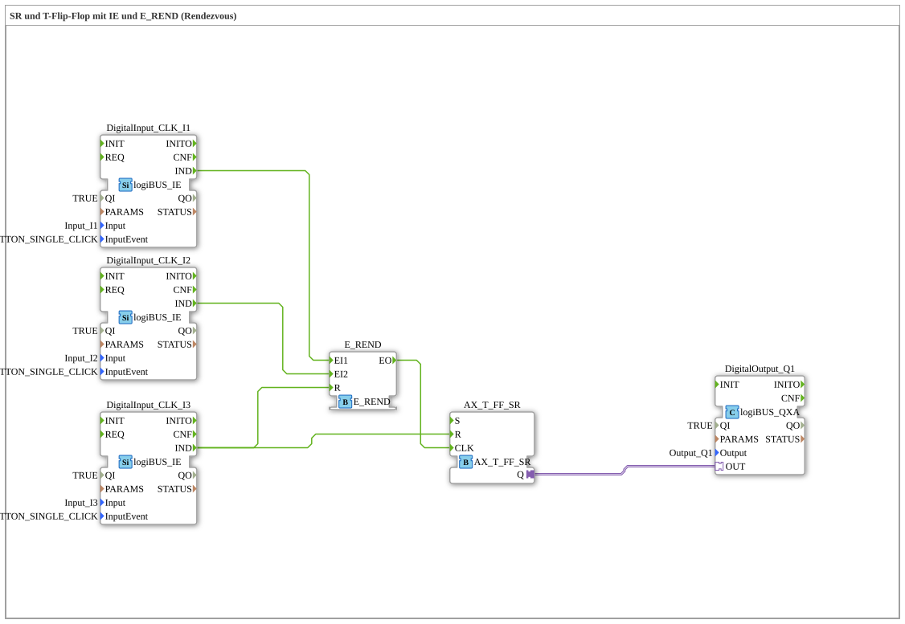

# Exercise_004a7_AX: SR and T Flip-Flop with IE and E_REND (Rendezvous)

[(https://notebooklm.google.com/notebook/041f4df4-b729-484d-b786-b6dcdf151961)
This article describes the logiBUS® exercise `Uebung_004a7_AX`. It combines the rendezvous pattern with an extended flip-flop type that provides set and reset functionality.
----
## Objective of the Exercise

Demonstration of the interaction between event logic (`E_REND`) and state logic (`AX_T_FF_SR` - toggle flip-flop with set/reset).

-----

## Description and Components

[cite_start]The subapplication `Uebung_004a7_AX.SUB` uses two pushbuttons for arming (rendezvous) and a third for explicit reset[cite: 1].

### Function Blocks (FBs)

- **`I1` & `I2`**: Inputs for the rendezvous.
- **`I3`**: Reset input.
- **`E_REND`**: Synchronizes `I1` and `I2`.
- **`AX_T_FF_SR`**: A toggle flip-flop that also has a `R` (Reset) input to set the output to FALSE.

-----

## Functionality

<EventConnections>
<Connection Source="DigitalInput_CLK_I1.IND" Destination="E_REND.EI1"/>
<Connection Source="DigitalInput_CLK_I2.IND" Destination="E_REND.EI2"/>
<Connection Source="E_REND.EO" Destination="AX_T_FF_SR.CLK"/>
<Connection Source="DigitalInput_CLK_I3.IND" Destination="AX_T_FF_SR.R"/>
<Connection Source="DigitalInput_CLK_I3.IND" Destination="E_REND.R"/>
</EventConnections>

[cite_start][cite: 1]

1. To turn on (or toggle) the lamp (`Q1`), press `I1` and `I2` (Rendezvous -> `CLK`).
2. The button `I3` is the "emergency stop" or "clear all" button. It is connected to:
- `E_REND.R`: Clears any partially completed rendezvous states.
- `AX_T_FF_SR.R`: Hard resets the flip-flop to FALSE (lamp off).

-----

## Application Example

**Machine Start with Reset**: Two safety zones must be reported as "clear" (`I1`, `I2`) before the machine can start (`CLK`). An emergency stop button (`I3`) stops the machine immediately and clears all permissions.
