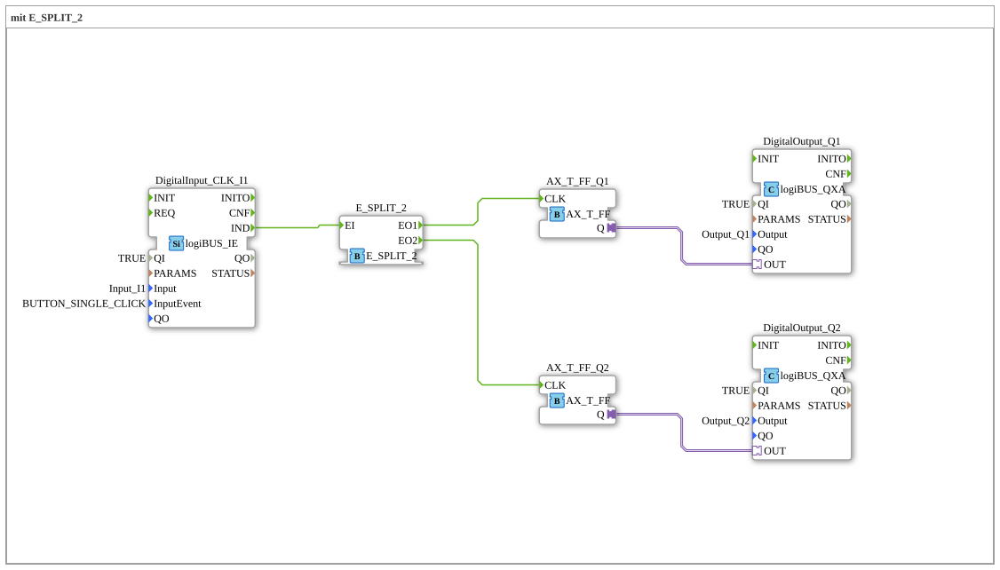

# Exercise_004a8_AX: with E_SPLIT_2
[](https://notebooklm.google.com/notebook/041f4df4-b729-484d-b786-b6dcdf151961)
This article describes the logiBUS® exercise `Uebung_004a8_AX`. This is a variant of `Uebung_004a4_AX`, which uses a specific function block `E_SPLIT_2` explicitly designed for two outputs.
----
## Objective of the Exercise
To become familiar with the specific splitter function blocks. `E_SPLIT` is often the generic name, but many libraries have specific versions such as `E_SPLIT_2`, `E_SPLIT_3`, etc., to define the number of outputs.

## Description and Components

[cite_start]The subapplication `Uebung_004a8_AX.SUB` uses `E_SPLIT_2` to distribute a button click to two independent flip-flops[cite: 1].

### Function Blocks (FBs)



* **`DigitalInput_CLK_I1`**: Button.
* **`E_SPLIT_2`**: Distributes input `EI` sequentially to `EO1` and `EO2`.
* **`AX_T_FF_Q1` & `Q2`**: Two flip-flops for the outputs `Q1` and `Q2`.

-----

## Functionality

```xml
<EventConnections>
<Connection Source="DigitalInput_CLK_I1.IND" Destination="E_SPLIT_2.EI"/>
<Connection Source="E_SPLIT_2.EO1" Destination="AX_T_FF_Q1.CLK"/>
<Connection Source="E_SPLIT_2.EO2" Destination="AX_T_FF_Q2.CLK"/>
</EventConnections>

[cite_start][cite: 1]

Functionally identical to `Uebung_004a4_AX`: An input event triggers two output events sequentially, ensuring both flip-flops are controlled reliably and in a defined manner.

----

## Application Example

Synchronous switching of redundant systems where it must be ensured that both systems receive the switching command.