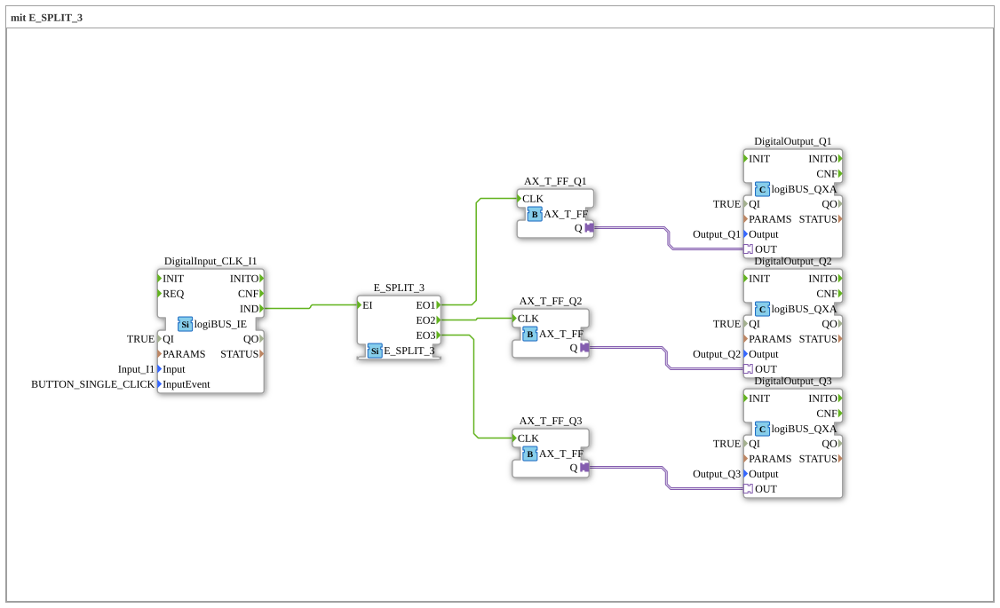

# Exercise_004a9_AX: with E_SPLIT_3

This article describes the logiBUS® exercise `Uebung_004a9_AX`. Here, the concept of event splitting is extended to three objectives.
----
## Objective of the Exercise

Demonstrating the scalability of event distributors. With `E_SPLIT_3`, three processes can be triggered sequentially.

-----

## Description and Components

[cite_start]The subapplication `Uebung_004a9_AX.SUB` distributes the signal from a button to three separate toggle flip-flops and thus to three outputs[cite: 1].

### Function Blocks (FBs)

* **`DigitalInput_CLK_I1`**: Pushbutton.
* **`E_SPLIT_3`**: Distributes input `EI` sequentially to `EO1`, `EO2`, and `EO3`.
* **`AX_T_FF_Q1`, `Q2`, `Q3`**: Three flip-flops.
* **`DigitalOutput_Q1`, `Q2`, `Q3`**: Three lamps.

-----

## How it works

<EventConnections>
<Connection Source="DigitalInput_CLK_I1.IND" Destination="E_SPLIT_3.EI"/>
<Connection Source="E_SPLIT_3.EO1" Destination="AX_T_FF_Q1.CLK"/>
<Connection Source="E_SPLIT_3.EO2" Destination="AX_T_FF_Q2.CLK"/>
<Connection Source="E_SPLIT_3.EO3" Destination="AX_T_FF_Q3.CLK"/>
</EventConnections>

[cite_start][cite: 1]

A single click of the button triggers a cascade:

1. `EO1` fires -> `Q1` toggles.
2. `EO2` fires -> `Q2` toggles.
3. `EO3` fires -> `Q3` toggles.

This happens so quickly within the PLC cycle time that it appears simultaneous to the human eye, but from a control engineering perspective, it is a defined sequence.

-----

## Application Example

**Central switch for one floor**: A button at the apartment door switches the lights in the hallway (`Q1`), kitchen (`Q2`) and living room (`Q3`) off (or toggles them) simultaneously.
