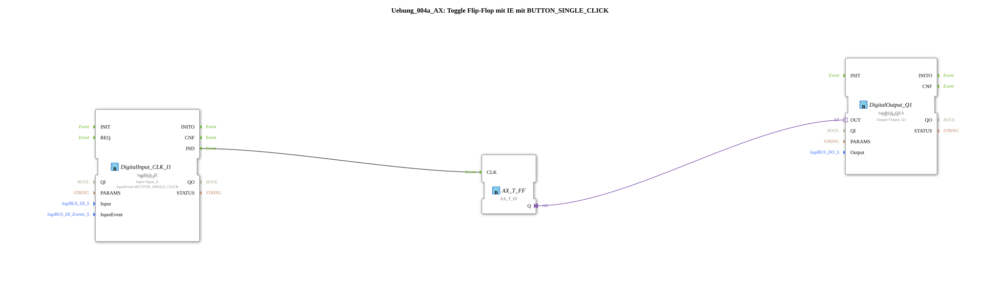

# Exercise_004a_AX: Toggle Flip-Flop with IE using BUTTON_SINGLE_CLICK

This article describes the logiBUS® exercise `Uebung_004a_AX`. In this exercise, we move beyond simple data forwarding and use events to implement a memory function: a classic impulse switch.

----

## Objective of the Exercise

The objective is to understand the difference between state-oriented (level) and event-oriented (edge) programming. While a simple push button is only "on" as long as it is pressed, here each press of the button should change the state of the output (toggling: Off -> On -> Off -> ...).

-----

## Description and Components

[cite_start]The subapplication `Uebung_004a_AX.SUB` uses a special input block that generates click events and a toggle flip-flop[cite: 1].

### Function Blocks (FBs)

* **`DigitalInput_CLK_I1`**: Type `logiBUS_IE` (Input Event). [cite_start]Unlike `IXA` (Input Extended Adapter), this block does not provide a continuous `BOOL` signal, but rather fires a single event (`IND`) when a specific condition is met. Here it is configured as `BUTTON_SINGLE_CLICK`[cite: 1].

* **`E_T_FF`**: Type `AX_T_FF` (Adapter Toggle Flip-Flop). [cite_start]This component has a clock input (`CLK`). With each received event, it toggles its internal state and outputs it via the adapter output `Q`[cite: 1].

* **`DigitalOutput_Q1`**: Type `logiBUS_QXA`. [cite_start]Switches the physical output `Q1` based on the flip-flop's state[cite: 1].

-----

## Functionality

1. The user briefly presses the button on `I1` ("click").

2. The `DigitalInput_CLK_I1` recognizes the "single click" pattern and sends a `IND` event.

3. The event reaches the `CLK` input of the `E_T_FF`.

4. The flip-flop changes its state (e.g., from FALSE to TRUE).

5. The new state is sent via the adapter output `Q` to `DigitalOutput_Q1`.

6. The lamp at `Q1` turns on and stays on even after the button is released.

7. The process repeats with the next click; the flip-flop returns to FALSE, and the lamp turns off.

-----

## Application Example

Classic **hallway lighting** or **stairwell lighting** (without a timer): Pressing a button turns the light on, and the next press turns it off. This is not possible with a purely electrical switch (which springs back); a storage element is required (impulse relay in electrical engineering, flip-flop in software).