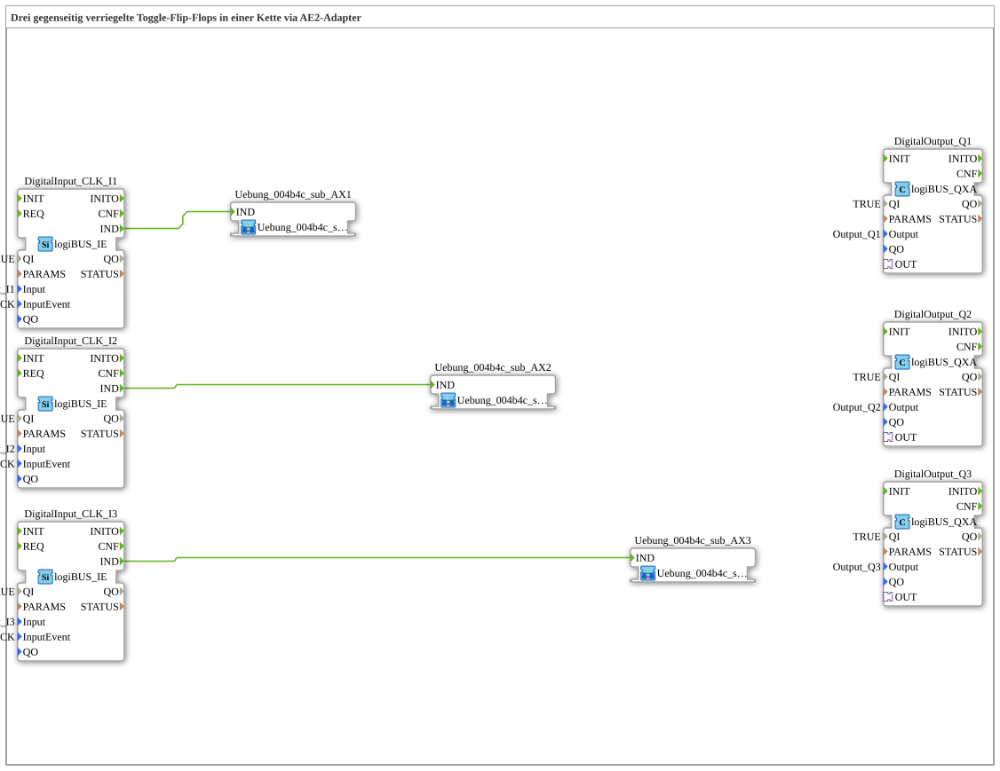

# Exercise_004b4c_AX: Three Interlocked Toggle Flip-Flops in a Chain via AE2 Adapter

* * * * * * * * * *
## Introduction
This exercise deals with the implementation of a chain of three interlocked toggle flip-flops. The interlocking is achieved via AE2 adapters (bidirectional interfaces), so that each sub-function can only change its state when the preceding flip-flops are inactive. This ensures that only one output can be active at any given time. The inputs are controlled via logiBUS pushbuttons (single-click event), and the outputs are indicated via logiBUS LEDs.
## Function Blocks (FBs) Used
The following table lists the function blocks used in the network:

| Function Block Name | Type | Description |
|----------------------------------|-------------------|--------------|
| `DigitalInput_CLK_I1`, `I2`, `I3` | `logiBUS_IE` | Digital input for pushbuttons (single-click) at the physical inputs `Input_I1`, `Input_I2`, `Input_I3`. |
| `DigitalOutput_Q1`, `Q2`, `Q3` | `logiBUS_QXA` | Digital output for controlling the physical outputs `Output_Q1`, `Output_Q2`, `Output_Q3`. |
| `Uebung_004b4c_sub_AX1` … `AX3` | `Uebung_004b4c_sub_AE` (SubApp) | Sub-component, each containing a toggle flip-flop with latching logic. |
| `Uebung_004b4c_sub_AX1` … `AX3` | `Uebung_004b4c_sub_AE` | ...
### Sub-Blocks: `Uebung_004b4c_sub_AE`

- **Type**: SubApp (reusable component)
- **Internal Function Blocks Used**: The SubApp implements a toggle flip-flop (e.g., with an SR flip-flop or a memory element) and a latching circuit that evaluates the state of neighboring SubApps via the AE2 adapters.

`` - **Interfaces**:

- Event input `IND` (from the button)
- Adapter socket and adapter plug (type AE2) for bidirectional communication with neighboring devices
- Data output `Q` (Boolean) for the current flip-flop state
- **Functionality**:

Each sub-function operates as a toggle flip-flop: Upon each positive event at `IND`, the internal state (and thus `Q`) changes, provided the latching condition is met. The latching ensures that a flip-flop can only switch if all preceding flip-flops in the chain are in an inactive state (`Q=0`). The AE2 adapters enable unidirectional state transmission to the next link in the chain. The comment **"using a bidirectional adapter: 1 connection IS SUFFICIENT!"** indicates that only a single adapter connection (to the next link) is necessary for the entire locking logic per sub-app.

## Program Flow and Connections

The three sub-modules are arranged in a chain:

Uebung_004b4c_sub_AX1` (first link) → `Uebung_004b4c_sub_AX2` (second link) → `Uebung_004b4c_sub_AX3` (third link)

- **Event Connections**:

Each button (`DigitalInput_CLK_I1` … `I3`) generates an event at output `IND` when pressed, which is directly forwarded to event input `IND` of the corresponding sub-module.

- **Adapter Connections**:
- The plug of `Uebung_004b4c_sub_AX1` is connected to the socket of `Uebung_004b4c_sub_AX2`.
- The plug of `Uebung_004b4c_sub_AX2` is connected to the socket of `Uebung_004b4c_sub_AX3`.

These connections pass the current state of each flip-flop to the next (e.g., as a block signal). This ensures that a flip-flop can only toggle if all preceding flip-flops are in the state `false`.

- **Output Connections**:

The output `Q` of each sub-module is connected via an adapter connection (e.g., `Uebung_004b4c_sub_AX1.Q → DigitalOutput_Q1.OUT`) to the corresponding digital output `OUT` of the `logiBUS_QXA` module. The outputs `Q1`, `Q2`, and `Q3` are connected to the physical LEDs.

**Procedure**:

1. No button is pressed: All outputs are off (inactive).

2. When button I1 is pressed, SubApp AX1 toggles to active (Q1 on). The interlock allows this because all previous stages are inactive.

3. When button I2 is pressed, SubApp AX2 toggles only if AX1 is inactive. Since AX1 is currently active, no toggling occurs (interlock).

4. Only when button I1 is pressed again (AX1 becomes inactive) can button I2 activate the second flip-flop.

5. The same applies analogously to the third stage.

This exercise demonstrates the implementation of a sequential interlocking chain with minimal connections using bidirectional AE2 adapters.

## Summary
In this exercise, a chain of mutually interlocking toggle flip-flops was constructed using three identical sub-modules (`Uebung_004b4c_sub_AE`). The interlocking ensures that only one output can be active at any given time. The implementation utilizes logiBUS input and output modules as well as AE2 adapters to enable communication between the sub-modules with only one cable connection per stage. This demonstrates a simple and efficient interlocking logic concept.
