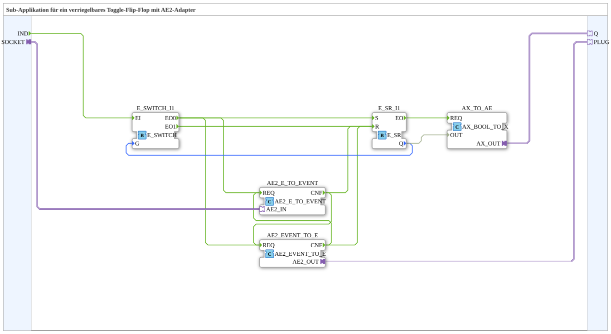

# Exercise_004b4c_sub_AE: Sub-application for a latching toggle flip-flop with AE2 adapter

* * * * * * * * * *
## Introduction
This sub-application implements a latching toggle flip-flop that can be controlled via an **AE2 adapter (socket)** and receive feedback via an **AE2 adapter (plug)** and an **AX adapter (Q)**. The flip-flop is toggled by an incoming event at input `IND`. It can also be reset via the AE2 adapter, which represents the **latching** function. The current state of the flip-flop is output via the AX adapter.

## Function Blocks (FBs) Used
- **`E_SR_I1`** – Type: `iec61499::events::E_SR`

Set-Reset flip-flop with Boolean output `Q`. The set input `S` sets `Q` to `TRUE`, and the reset input `R` sets `Q` to `FALSE`.

- **`E_SWITCH_I1`** – Type: `iec61499::events::E_SWITCH`

Event switch. An incoming event at input `EI` is forwarded to output `EO0` (if `G=FALSE`) or `EO1` (if `G=TRUE`), depending on the Boolean value at input `G`.

- **`AE2_EVENT_TO_E`** – Type: `adapter::conversion::bidirectional::AE2_EVENT_TO_E`

Converts an event received via the **AE2 socket** into an internal event. An event is output at `CNF` as soon as an event is present at the adapter.

- **`AE2_EVENT_TO_E`** – Type: `adapter::conversion::bidirectional::AE2_EVENT_TO_E`

Converts an event received via the **AE2 socket** into an internal event. An event is output at `CNF` as soon as an event is present at the adapter.

`` - **`AE2_E_TO_EVENT`** – Type: `adapter::conversion::bidirectional::AE2_E_TO_EVENT`

Converts an internal event (input `REQ`) into an event that can be sent via the **AE2 plug**. The acknowledgment event appears at output `CNF`.

- **`AX_TO_AE`** – Type: `adapter::conversion::unidirectional::AX_BOOL_TO_X`

Converts the flip-flop's Boolean output `Q` into an AX adapter signal, which is output at plug `Q`.

## Program Flow and Connections

1. **Event Acceptance**

The incoming event at input `IND` is directly forwarded to the event input `EI` of the turnout `E_SWITCH_I1`.

2. **Turnout Control via Flip-Flop State**

The output `Q` of the flip-flop `E_SR_I1` is connected to the control input `G` of the turnout.

- If `Q = FALSE` is in the state of `Q = FALSE`, the turnout switches the event to its output `EO0`.

2. **Turnout Control via Flip-Flop State**

The output `Q` of the flip-flop `E_SR_I1` is connected to the control input `G` of the turnout. - If `Q = TRUE` is present, it switches to `EO1`.

3. **Toggle Function**

- `EO0` is connected to the set input `S` of the flip-flop → sets `Q` to `TRUE`.
- `EO1` is connected to the reset input `R` of the flip-flop → sets `Q` to `FALSE`.

This causes the flip-flop to toggle with each incoming event.

4. **Integration of the AE2 Adapter**

- The event from `EO0` is also routed to the `REQ` inputs of **both** adapter converters (`AE2_EVENT_TO_E` and `AE2_E_TO_EVENT`).
- The converters are interconnected:
- The `CNF` output of `AE2_EVENT_TO_E` triggers the `REQ` input of `AE2_E_TO_EVENT` and simultaneously goes to the reset input `R` of the flip-flop.
- The output of `CNF` from `AE2_E_TO_EVENT` triggers the input of `REQ` from `AE2_EVENT_TO_E` and is also sent to the reset input `R` of the flip-flop.
- This loop ensures that **every** event arriving via the socket (converted by `AE2_EVENT_TO_E`) resets the flip-flop and simultaneously sends an event to the plug. This allows an external controller to lock the flip-flop.

... 5. **State Output**

The Boolean value `Q` of the flip-flop is converted into an AX adapter signal via `AX_TO_AE` and output at the plug as `Q`.

## Summary

This exercise deepens the understanding of using **AE2 adapters** for bidirectional event communication and demonstrates the implementation of a **lockable toggle flip-flop**. The combined use of a set-reset flip-flop, an event switch, and adapter converters shows how event-driven feedback and external control interventions can be implemented modularly in the 4diac IDE.

`` **Learning Objectives:**

- Understanding AE2 adapter communication (socket/plug)
- Building a toggle logic using `E_SR` and `E_SWITCH`
- Implementing a locking mechanism through cyclic event chaining
- Integrating adapter conversion modules

--

### 🌐 Relevant topic subpages on ms-muc-docs.de
* [🌐 Eclipse 4diac IDE & color reference on ms-muc-docs.de](https://www.ms-muc-docs.de/iec-61499/eclipse-4diac/)

]
