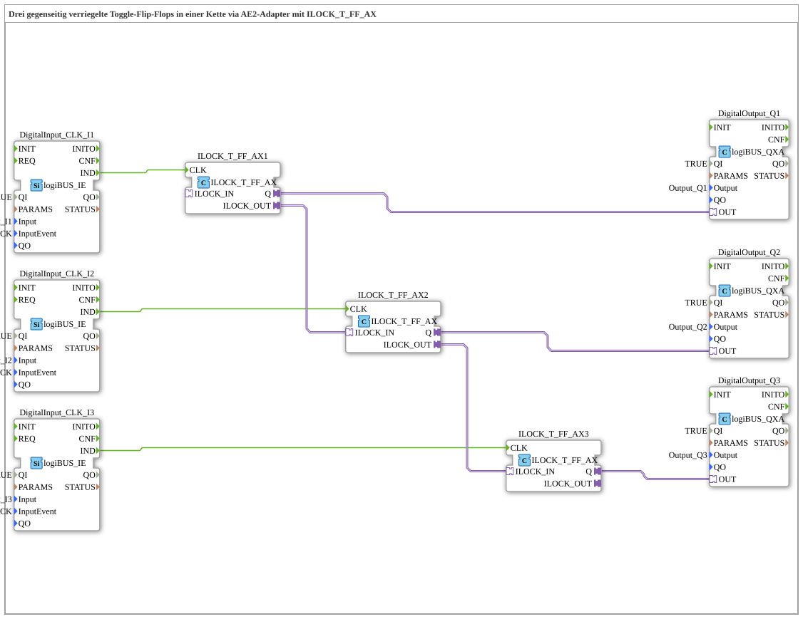

# Exercise_004b4d_AX: Three mutually interlocked toggle flip-flops in a chain via an AE2 adapter with ILOCK_T_FF_AX

* * * * * * * * * *
## Introduction
This exercise implements three mutually interlocked toggle flip-flops connected in a chain via an AE2 adapter. The function block `ILOCK_T_FF_AX` allows a single click to toggle one output. This automatically resets all other outputs (interlocking). The chain ensures that only one output can be active at a time.

## Function Blocks (FBs) Used
- **Digital Inputs (logiBUS_IE)** – three inputs for pushbuttons (Input_I1, Input_I2, Input_I3) with the event BUTTON_SINGLE_CLICK.
- **Digital Outputs (logiBUS_QXA)** – three outputs (Output_Q1, Output_Q2, Output_Q3) for indicating the active flip-flop stage.
- **ILOCK_T_FF_AX** (logiBUS::signalprocessing::interlock::ILOCK_T_FF_AX) – used three times:
- **Functionality**: A bistable element (toggle flip-flop) with a clock input `CLK` and an output `Q`. The internal state is toggled on each CLK event. Mutual interlocking is implemented via the adapters `ILOCK_IN` and `ILOCK_OUT`: As soon as this function block (FB) becomes active, it resets all subsequent FBs via `ILOCK_OUT`. Simultaneously, `ILOCK_IN` locks the FB if a preceding FB is active.

### Sub-Blocks

No sub-blocks are defined within this sub-app. All FB types used are from the library `logiBUS`.

## Program Flow and Connections

1. **Event Chaining**

- The three buttons (`DigitalInput_CLK_I1`, `I2`, `I3`) generate an event `IND` upon single-click.
- This event is forwarded directly to the CLK input of the corresponding `ILOCK_T_FF_AX`.

2. **Adapter Connections (Locking Chain)**

- `ILOCK_T_FF_AX1.ILOCK_OUT` → `ILOCK_T_FF_AX2.ILOCK_IN`
- `ILOCK_T_FF_AX2.ILOCK_OUT` → `ILOCK_T_FF_AX3.ILOCK_IN`
- This creates a cascade: If FB1 becomes active, it locks FB2; if FB2 becomes active, it locks FB3. A subsequent FB can only become active if the preceding one is inactive.
- A comment in the network indicates that, due to the bidirectional adapter, only one connection per stage is sufficient.
... 3. **Output Chaining**

- Each `ILOCK_T_FF_AX` has an output adapter `Q`, which is connected to the corresponding digital output (`DigitalOutput_Q1`…`Q3`).
- The outputs indicate the state of the active flip-flop.

4. **Operation**

- Pressing button I1, I2, or I3 toggles the respective flip-flop.
- When a flip-flop becomes active, all subsequent flip-flops in the chain are reset.
- A previously active flip-flop remains active only as long as no upstream flip-flop is toggled.

## Summary

This exercise demonstrates the construction of an interlocked toggle chain using the function block `ILOCK_T_FF_AX`. Learning objectives include understanding:

- Toggle flip-flops and their state transitions,
- Interlocking via adapter interfaces,
- Cascaded blocking logic where only one output can be active at any given time.

This setup is suitable for applications such as switching or priority controls where multiple controls need to operate exclusively.