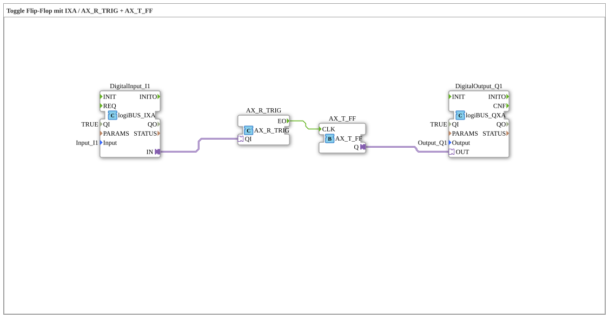

# Exercise_004b5_AX: Toggle Flip-Flop with IXA / AX_R_TRIG + AX_T_FF

* * * * * * * * * *
## Introduction
This exercise implements a toggle flip-flop using a logiBUS input and output adapter (IXA/QXA) and the adapter function blocks AX_R_TRIG (edge detection) and AX_T_FF (toggle flip-flop). The behavior: On each rising edge of the digital input signal, the output toggles its state.
## Function Blocks Used (FBs)
- **DigitalInput_I1** (Type: logiBUS::io::DI::logiBUS_IXA)
- Parameters: QI = TRUE, Input = Input_I1
- Purpose: Reads the physical digital input "Input_I1" and provides the signal as adapter output IN.
- **DigitalOutput_Q1** (Type: logiBUS::io::DQ::logiBUS_QXA)
- Parameters: QI = TRUE, Output = Output_Q1
- Purpose: Passes the signal present at its adapter input OUT to the physical digital output "Output_Q1".
- **AX_R_TRIG** (Type: adapter::events::unidirectional::AX_R_TRIG)
- Events: Event output EO is triggered on a rising edge at adapter input QI.
- **AX_T_FF** (Type: adapter::events::unidirectional::AX_T_FF)
- Events: Event input CLK toggles the internal state with each event. Output Q reflects the current state.

## Program Flow and Connections

The program flow is defined via adapter and event connections in the network:

1. **Adapter Connection** from `DigitalInput_I1.IN` to `AX_R_TRIG.QI`:

The input signal is fed to the adapter input QI of the edge detector.

2. **Event Connection** from `AX_R_TRIG.EO` to `AX_T_FF.CLK`:

On a rising edge at the input, AX_R_TRIG generates an event that clocks the toggle flip-flop.

3. **Adapter Connection** from `AX_T_FF.Q` to `DigitalOutput_Q1.OUT`:

The current output state of the toggle flip-flop is transferred to the output adapter.

**Procedure:**

- The digital input (e.g., a push button) provides a signal.
- Each rising edge (signal change from 0→1) at the input is detected by `AX_R_TRIG`.
- An event is then sent to `AX_T_FF`, whose output toggles its state.
- The changed state appears at the digital output.

## Summary

This exercise demonstrates the combination of adapter function blocks to implement a toggle flip-flop. It connects a physical input to a toggle element via an edge detector and outputs the result to a physical output. This is a typical basic structure for switching an output with a single button in automation technology.
