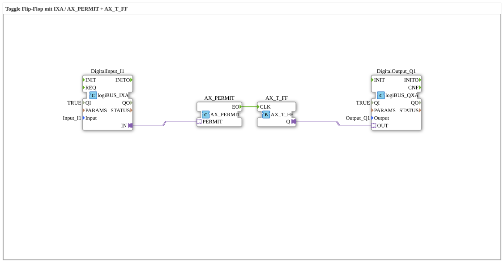

# Exercise_004b6_AX: Toggle Flip-Flop with IXA / AX_PERMIT + AX_T_FF

* * * * * * * * * *
## Introduction
This exercise demonstrates the use of a toggle flip-flop (T-FF) in combination with an enable mechanism. A digital input (logiBUS_IXA) is routed via an **AX_PERMIT** adapter to the clock input of an **AX_T_FF** adapter. The output of the T-FF controls a digital output (logiBUS_QXA). This allows the output state to be toggled on every rising edge at the input – but only if the input has been previously enabled by **AX_PERMIT**.
## Function Blocks (FBs) Used

| FB Instance | Type | Parameters |

|------------|-----|-----------|

| `DigitalInput_I1` | `logiBUS::io::DI::logiBUS_IXA` | `QI = TRUE`, `Input = "Input_I1"` |

| `DigitalOutput_Q1` | `logiBUS::io::DQ::logiBUS_QXA` | `QI = TRUE`, `Output = "Output_Q1"` |

| `AX_PERMIT` | `adapter::events::unidirectional::AX_PERMIT` | (no parameters set) |

| `AX_T_FF` | `adapter::events::unidirectional::AX_T_FF` | (No parameters set) |

### Adapter Descriptions
- **logiBUS_IXA**: Reads a digital input from the logiBUS hardware.
- **logiBUS_QXA**: Switches a digital output from the logiBUS hardware.
- **AX_PERMIT**: An adapter that only passes on an incoming event if the connected adapter input (here, the input value) is active.
- **AX_T_FF**: A toggle flip-flop adapter. With each event at the clock input (CLK), the internal state is toggled and made available via the output (Q).

## Program Flow and Connections

The diagram shows the following connections (from the SubAppNetwork configuration):

1. **Adapter Connection**:

- `DigitalInput_I1.IN` (output of the input block) → `AX_PERMIT.PERMIT`

*(The digital input value enables the AX_PERMIT adapter.)*

2. **Event Connection**:

- `AX_PERMIT.EO` (event output of the enable adapter) → `AX_T_FF.CLK`
*(An event is only sent to the clock input of the T-FF when the enable is active.)*

3. **Adapter Connection**:

- `AX_T_FF.Q` (state output of the T-FF) → `DigitalOutput_Q1.OUT`
*(The current The flip-flop state is passed to the digital output.)*

**Detailed Functionality:**

- The input `Input_I1` is continuously read by `DigitalInput_I1`.
- The read value (TRUE/FALSE) is passed as an enable signal to `AX_PERMIT.PERMIT`.
- An event (e.g., a rising edge at the input) does not occur explicitly – event control is handled by the runtime environment. The **AX_PERMIT** adapter only passes on an internally generated event if the enable input is `TRUE`.
- This event reaches the clock input of the **AX_T_FF**, which then toggles its output state.
- The new state is output at `Output_Q1`.

``` This combination allows an output to be switched on and off toggled using a single digital input – but only as long as the input is active (enabled). As soon as the input goes to FALSE, no further clock pulses are allowed through, and the output retains its last state.

## Summary

Exercise "Exercise_004b6_AX" illustrates the coupling of hardware adapters (logiBUS) with event/data adapters (AX_PERMIT, AX_T_FF). It demonstrates how to implement a toggle flip-flop whose clock is enabled. This fundamental principle is used in control engineering, for example, for switching operating modes or debouncing signals.
