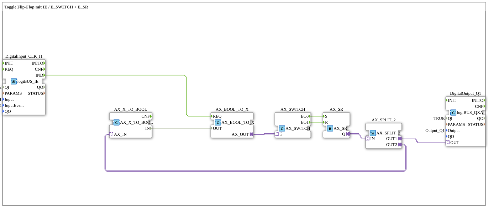

# Exercise_004b_AX: Toggle Flip-Flop with IE / E_SWITCH + E_SR

[(https://notebooklm.google.com/notebook/041f4df4-b729-484d-b786-b6dcdf151961)
This article describes the logiBUS® exercise `Uebung_004b_AX`. This exercise demonstrates an alternative implementation of a latching switch using data-to-event conversion and switches.

> **Note:** This solution is considered "not recommended" (see comment in the code) because it is unnecessarily complex. It serves here as a teaching example for the function blocks `AX_SWITCH`, `AX_BOOL_TO_X`, and `AX_X_TO_BOOL`.

----

## Objective of the Exercise

Understanding the interaction between Boolean data and event flow control.

-----

## Description and Components

[cite_start]The subapplication `Uebung_004b_AX.SUB` discretely builds a toggle mechanism[cite: 1].

### Function Blocks (FBs)

* **`DigitalInput_CLK_I1`**: Returns an event on click.
* **`AX_BOOL_TO_X`**: Converts a Boolean value into an adapter signal (data + event). Used here to convert the current state of the flip-flop into a control signal for the switch.
* **`AX_SWITCH`**: A toggle switch. Depending on the value at input `G`, it forwards an event to either `EO0` or `EO1`.
* **`E_SR`**: Set/Reset Flip-Flop (event-based).
* **`AX_SPLIT_2`**: Distributes the flip-flop output (once to the lamp, once to the feedback loop).
* **`AX_X_TO_BOOL`**: Extracts the Boolean state from the adapter signal for the feedback loop.

-----

## Functionality

The basic idea is:

1. A click event arrives.
2. Where should it go? -> To "turn on" (`S`) or to "turn off" (`R`)?
3. This is decided by `AX_SWITCH` based on the *current* state.
* If the lamp is off (`G=0`), the event goes to `EO0` -> `E_SR.S` (set).
* If the lamp is on (`G=1`), the event goes to `EO1` -> `E_SR.R` (reset).

This feedback loop effectively turns the SR flip-flop into a toggle flip-flop.

-----

## Evaluation

Why is this "bad"?

* High component complexity for a simple function.
* Feedback loops in event-driven systems can lead to race conditions or infinite loops if you're not careful (the separation of event and data path makes it functional here, but difficult to read).
* A simple ``AX_T_FF`` (as in exercise 004a) accomplishes the same thing in a single component.