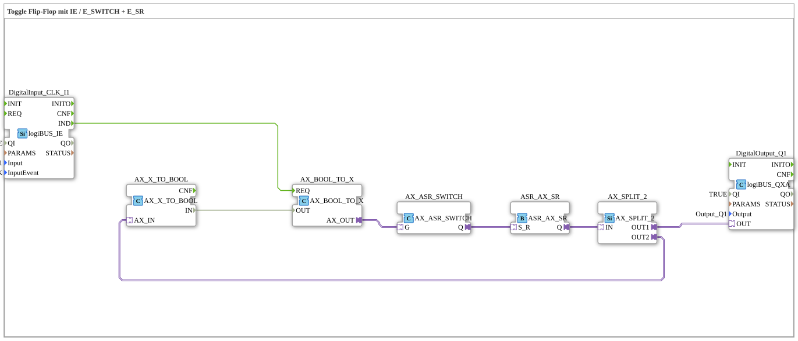

Here is the documentation for exercise `Uebung_004b_AX_ASR` based on the provided information.
# Exercise_004b_AX_ASR: Toggle Flip-Flop with IE / E_SWITCH + E_SR

* * * * * * * * * *
## Introduction
Exercise **Exercise_004b_AX_ASR** implements a toggle flip-flop logic circuit, but using special adapter components instead of classic Boolean logic components. The goal is to toggle the state of a digital output (Q1) (On/Off) each time a button (I1) is pressed.

This exercise primarily serves demonstration purposes to show the functionality and chaining of adapter events and data. As noted in the source code, this implementation is **not recommended** for simple switching tasks in practice due to the high complexity and number of components.

[Note: The original text contains a separate, unrelated comment and is omitted from the translation.]
## Function Blocks (FBs) Used

This sub-application uses various function blocks from the `logiBUS` and `adapter` libraries to implement the logic.

### LogiBUS IO Function Blocks
* **DigitalInput_CLK_I1** (`logiBUS::io::DI::logiBUS_IE`)
* Serves as an input event.
* **Parameters**: `Input` = `Input_I1` (Logical Input 1), `InputEvent` = `BUTTON_SINGLE_CLICK` (Responds to a single click).
* **Function**: Provides an event signal when the button is pressed.
* * **DigitalOutput_Q1** (`logiBUS::io::DQ::logiBUS_QXA`)
* Serves as an output interface.
* **Parameters**: `Output` = `Output_Q1`.
* **Function**: Controls the physical output based on the adapter signal.

### Adapter Logic Blocks

These blocks process signals via adapter connections (`AX_...`), which encapsulate data and events.

* **AX_SR** (`adapter::events::unidirectional::AX_SR`)
* **Type**: Set/Reset Flip-Flop (adapter variant).
* **Function**: Stores the state (On/Off). It is controlled by events at the inputs `S` (Set) and `R` (Reset) and outputs the status via the adapter output `Q`.
* **AX_SWITCH** (`adapter::events::unidirectional::AX_SWITCH`)
* **Type**: Switch.
* **Function**: Routes incoming signals to different outputs (`EO0`, `EO1`) based on their state. Used here to switch between setting and resetting the flip-flop.
* **AX_SPLIT_2** (`adapter::events::unidirectional::AX_SPLIT_2`)
* **Type**: Signal splitter.
* * **Function**: Splits the flip-flop's adapter output into two paths: one for the physical output and one for feedback.
* **AX_BOOL_TO_X** (`adapter::conversion::unidirectional::AX_BOOL_TO_X`)
* **Type**: Converter.
* **Function**: Converts a standard event and data signal into an adapter signal to control the `AX_SWITCH`.
* **AX_X_TO_BOOL** (`adapter::conversion::unidirectional::AX_X_TO_BOOL`)
* **Type**: Converter.
* **Function**: Converts an adapter signal back into standard data to provide the current status for feedback.

## Program Flow and Connections

The flow simulates a T-flip-flop using a feedback loop:

1. **Input Signal**: The event `IND` from the button **DigitalInput_CLK_I1** triggers the function block **AX_BOOL_TO_X**.

2. **Status Detection**: The current system status is determined via a feedback loop. The output of the flip-flop (**AX_SR**) is fed back via **AX_SPLIT_2** and **AX_X_TO_BOOL** and fed into **AX_BOOL_TO_X**.

3. **Switching Logic**:

* The **AX_SWITCH** receives the signal.
* Depending on the current state (feedback), either output `EO0` (connected to `AX_SR.S` -> Set) or `EO1` (connected to `AX_SR.R` -> Reset) is activated.

4. **Storage**: The **AX_SR** block changes its state accordingly (toggling).

5. **Output**: The new state is available at the adapter output `Q` of **AX_SR**.

6. **Distribution**:

* The signal is sent via **AX_SPLIT_2** to **DigitalOutput_Q1**, which switches the lamp/actuator.
* Simultaneously, the signal for the next click is fed back into the feedback loop.

**Note on Complexity:**
The network diagram contains a comment: *"not recommended!!! Far too many components"*. This underscores that this solution for a simple toggle function in a production environment is excessively complex (over-engineering). A simple `E_T_FF` (toggle flip-flop) or a combination of `E_SWITCH` and `E_SR` without adapter encapsulation would be more efficient.

## Summary

The exercise `Uebung_004b_AX_ASR` demonstrates the implementation of a toggle flip-flop using only adapter components (`AX_`) and converters. It clearly shows how adapter connections can be split and converted, but also serves as a negative example of efficiency for simple logic tasks. The learning objective is to understand the adapter technology within the 4diac IDE.

---

### 🌐 Related topic subpages on ms-muc-docs.de
* [🌐 Eclipse 4diac IDE & Color Reference on ms-muc-docs.de](https://www.ms-muc-docs.de/iec-61499/eclipse-4diac/)

]
