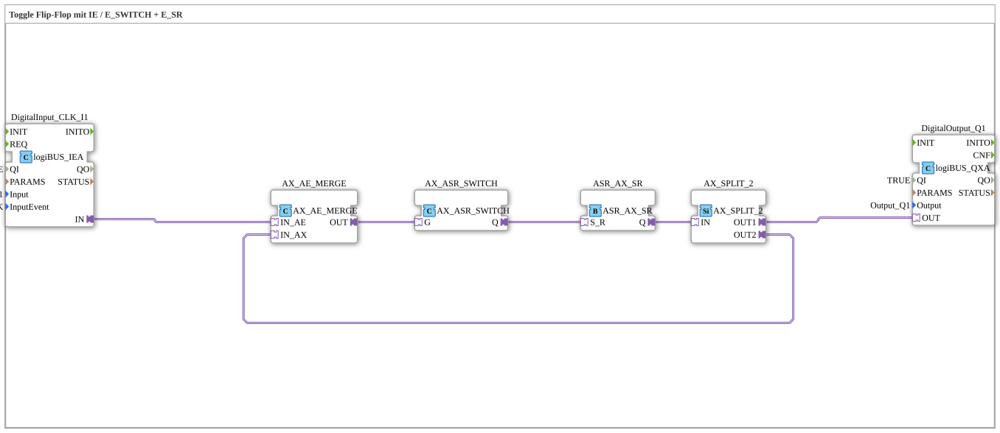

Here is the documentation for exercise `Uebung_004b_AX_ASR_X`.

# Exercise_004b_AX_ASR_X: Toggle Flip-Flop with IE / E_SWITCH + E_SR



* * * * * * * * * *

## Introduction
This exercise implements a **toggle flip-flop**, but using a very specific approach with adapter components (`AX`). The circuit's goal is to change the output state (On -> Off -> On) upon receiving an input signal (button press).

A special feature of this exercise is the note in the source code stating that this solution is **not recommended** due to the large number of components required for this simple task. It primarily serves to illustrate the concepts of adapter connections, signal splitting, and feedback loops in 4diac.


## Function Blocks (FBs) Used

This sub-application uses various function blocks from the `logiBUS` library for I/O connectivity and function blocks from the `adapter` library for logical processing.

### Main Function Blocks:

#### **DigitalInput_CLK_I1**

- **Type**: `logiBUS::io::DI::logiBUS_IE`
- **Description**: This function block detects the input signal (pushbutton).

- **Parameters**:

- `QI` = `TRUE`

- `Input` = `Input_I1`

- `InputEvent` = `BUTTON_SINGLE_CLICK`
- **Function**: Sends an event (`IND`) when the key is pressed once.

#### **DigitalOutput_Q1**

- **Type**: `logiBUS::io::DQ::logiBUS_QXA`

- **Description**: Controls the physical output.

- **Parameters**:

- `QI` = `TRUE`

- `Output` = `Output_Q1`

- **Function**: Receives the status from the adapter network and switches the output accordingly.

#### **AX_SR**

- **Type**: `adapter::events::unidirectional::AX_SR`

- **Description**: An adapter-based memory block (Set/Reset).

- **Function**: Stores the current state (TRUE or FALSE). It is controlled via the inputs `S` (Set) and `R` (Reset).


#### **AX_SWITCH**
- **Type**: `adapter::events::unidirectional::AX_SWITCH`
- **Description**: Serves as a switch for events/adapter signals.

- **Function**: Forwards the incoming signal to either `G` or `EO1`, based on the status at input `G`.

#### **AX_SPLIT_2**
- **Type**: `adapter::events::unidirectional::AX_SPLIT_2`
- **Description**: A splitter module.

- **Function**: Splits an incoming adapter signal (`IN`) into two outputs (`OUT1`, `OUT2`). This is needed here to simultaneously send the output state to the physical output and use it as feedback for the logic.

#### **AX_BOOL_TO_X** & **AX_X_TO_BOOL**
- **Type**: `adapter::conversion::unidirectional::...`
- **Description**: Conversion blocks.

- **Function**: Used to convert between classic data types and adapter structures to close the feedback loop.

## Program Flow and Connections

The logic of this exercise is based on feedback of the current state to determine whether the next button press should turn the device on (Set) or off (Reset).


1. **Input Signal**: A click on `DigitalInput_CLK_I1` triggers an event (`IND`), which activates the converter `AX_BOOL_TO_X` (`REQ`).

2. **Decision Logic (Switching)**: The signal reaches `AX_SWITCH` (input `G`).

3. **State Change**:

* `AX_SWITCH` is connected to `AX_SR` (memory).

* The memory is set via `EO0` (`S`).


* The memory is reset via `EO1` (`R`).

* The path taken depends on the current state of the feedback.

4. **Output and Feedback**:

* The output of memory `AX_SR` goes to splitter `AX_SPLIT_2`.

* **Branch 1 (`OUT1`)**: Goes directly to `DigitalOutput_Q1` to switch the lamp.

* **Branch 2 (`OUT2`)**: Is fed back. It runs via `AX_X_TO_BOOL` (conversion) back to `AX_BOOL_TO_X`.

5. **The Cycle**: This feedback loop allows the system to "know" its current state upon the next click, and the `AX_SWITCH` switches to the opposite state accordingly.

## Summary

Exercise **Exercise_004b_AX_ASR_X** demonstrates the creation of a toggle flip-flop using only adapter event blocks and converters.

Although the functionality (press button -> light on, press button -> light off) is present, the internal comment ("not recommended!!! far too many blocks") indicates that this is an academic exercise. It illustrates how to build complex adapter networks with feedback loops and signal crossovers (`SWITCH` and `SPLIT`), but does not provide an efficient solution for a simple impulse circuit.

---

### 🌐 Related topic subpages on ms-muc-docs.de

* [🌐 Eclipse 4diac IDE & color reference on ms-muc-docs.de](https://www.ms-muc-docs.de/iec-61499/eclipse-4diac/)


```