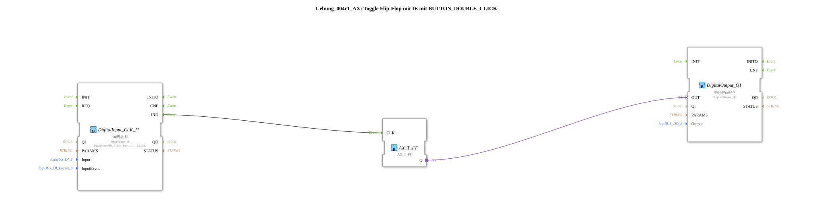

# Exercise_004c1_AX: Toggle Flip-Flop with IE using BUTTON_DOUBLE_CLICK

[(https://notebooklm.google.com/notebook/041f4df4-b729-484d-b786-b6dcdf151961)
This article describes the logiBUS® exercise `Uebung_004c1_AX`. From here on, we will focus on the advanced capabilities of the `logiBUS_IE` block, which can recognize complex button patterns.
----
## Objective of the Exercise

Using the event `BUTTON_DOUBLE_CLICK`.

-----

## Description and Components

[cite_start]The subapplication `Uebung_004c1_AX.SUB` toggles a lamp only on a double-click[cite: 1].

### Function Blocks (FBs)

* **`DigitalInput_CLK_I1`**: Configured with `InputEvent = BUTTON_DOUBLE_CLICK`.

-----

## Functionality

The function block monitors the input `I1`.

1. Pressing once: Nothing happens at the output `IND`.
2. Pressing twice in quick succession (within a defined time interval): The function block fires *a* `IND` event.
3. The flip-flop toggles.

-----

## Application Example

**Preventing Incorrect Operation**: Assign critical functions (e.g., "Delete All") to a double-click to prevent accidental activation.