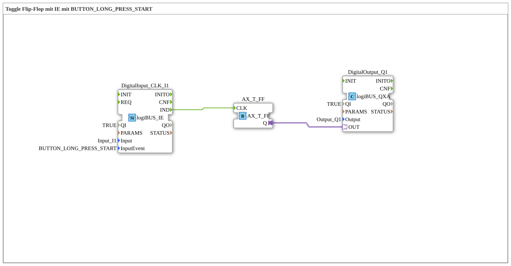

# Exercise_004c2_AX: Toggle Flip-Flop with IE using BUTTON_LONG_PRESS_START

This article describes the logiBUS® exercise `Uebung_004c2_AX`.
----
## Objective of the Exercise
Using the event `BUTTON_LONG_PRESS_START`.

-----

## Functionality

[cite_start]The function block `DigitalInput_CLK_I1` in `Uebung_004c2_AX.SUB` is configured to `BUTTON_LONG_PRESS_START`[cite: 1].

The event `IND` is triggered as soon as the button has been pressed and held for a specific duration (e.g., > 500 ms). It fires precisely when the timer expires, even if the button continues to be pressed.

-----

## Application Example

**Dimming Lights**: A short click switches the light on/off (see Exercise 004a). A long press (detected by `LONG_PRESS_START`) starts the dimming process.