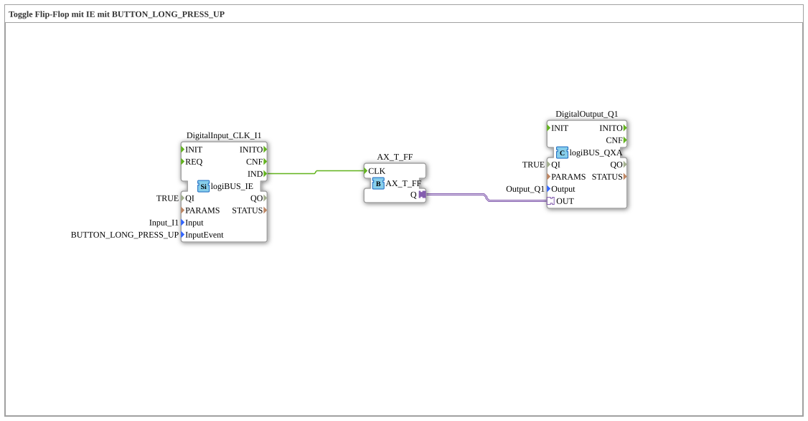

# Exercise_004c3_AX: Toggle Flip-Flop with IE using BUTTON_LONG_PRESS_UP

[(https://notebooklm.google.com/notebook/041f4df4-b729-484d-b786-b6dcdf151961)
This article describes the logiBUS® exercise `Uebung_004c3_AX`.
----
## Objective of the Exercise

Using the event `BUTTON_LONG_PRESS_UP`.

-----

## Functionality

[cite_start]The function block `DigitalInput_CLK_I1` in `Uebung_004c3_AX.SUB` is configured to `BUTTON_LONG_PRESS_UP`[cite: 1].

This event is triggered when the button is released *after* it has been detected as being held down. A short press does not trigger this event (that would be `SINGLE_CLICK`).

-----

## Application Example

**Ending the Dimming Process**: When the user releases the button, the dimming should stop and the current brightness level should be saved.