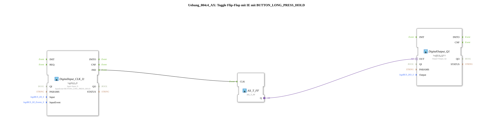

# Exercise_004c4_AX: Toggle Flip-Flop with IE using BUTTON_LONG_PRESS_HOLD

This article describes the logiBUS® exercise `Uebung_004c4_AX`.
----
## Objective of the Exercise

Using the event `BUTTON_LONG_PRESS_HOLD`.

-----

## Functionality

[cite_start]The function block `DigitalInput_CLK_I1` in `Uebung_004c4_AX.SUB` is configured to `BUTTON_LONG_PRESS_HOLD`[cite: 1].

This event fires *periodically* as long as the button is held down after the long press is detected.

-----

## Application Example

**Volume Change / Scrolling**: As long as the button is held down, the volume is increased incrementally or a menu is scrolled. The toggle function would flash very rapidly here, indicating that this event is intended for increment functions rather than toggles.