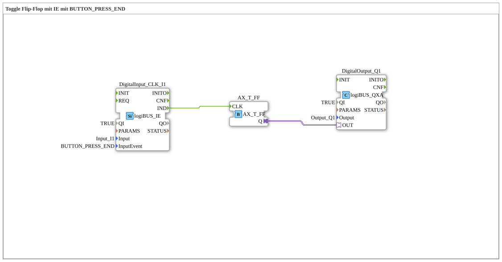

# Exercise_004c5_AX: Toggle Flip-Flop with IE using BUTTON_PRESS_END

This article describes the logiBUS® exercise `Uebung_004c5_AX`.
----
## Purpose of the Exercise

Using the event `BUTTON_PRESS_END`.

-----

## Functionality

[cite_start]The function block `DigitalInput_CLK_I1` in `Uebung_004c5_AX.SUB` is configured to `BUTTON_PRESS_END`[cite: 1].

This event fires *always* when the button is released, regardless of whether it was pressed briefly or for a long time.

-----

## Application Example

**Dead Man's Switch**: A function is active as long as the switch is pressed (starts when the level changes to HIGH) and must stop reliably when released (`PRESS_END`).