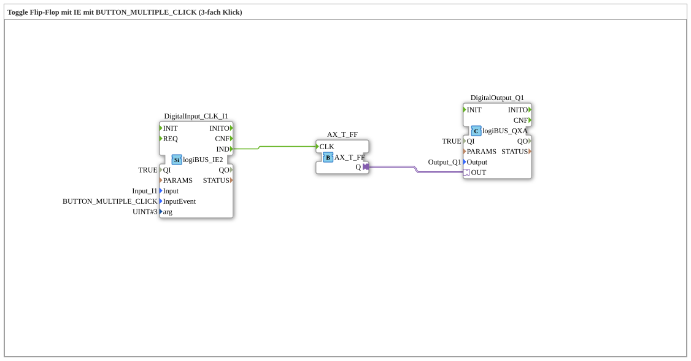

# Exercise_004c6_AX: Toggle Flip-Flop with IE using BUTTON_MULTIPLE_CLICK (triple click)

This article describes the logiBUS® exercise `Uebung_004c6_AX`. It uses the extended `logiBUS_IE2` function block, which accepts arguments.
----
## Objective of the Exercise

Configuration of a multi-click operation.

-----

## Description and Components

[cite_start]The subapplication `Uebung_004c6_AX.SUB` uses `logiBUS_IE2` with `InputEvent = BUTTON_MULTIPLE_CLICK` and `arg = 3`[cite: 1].

### Function Blocks (FBs)

* **`DigitalInput_CLK_I1`**: Type `logiBUS_IE2`. This type has the additional input `arg`.

-----

## Functionality

The event fires only when the user clicks exactly three times in quick succession (triple-click).

-----

## Application Example

**Hidden Service Menus**: Access to expert settings that a normal user should not accidentally activate.