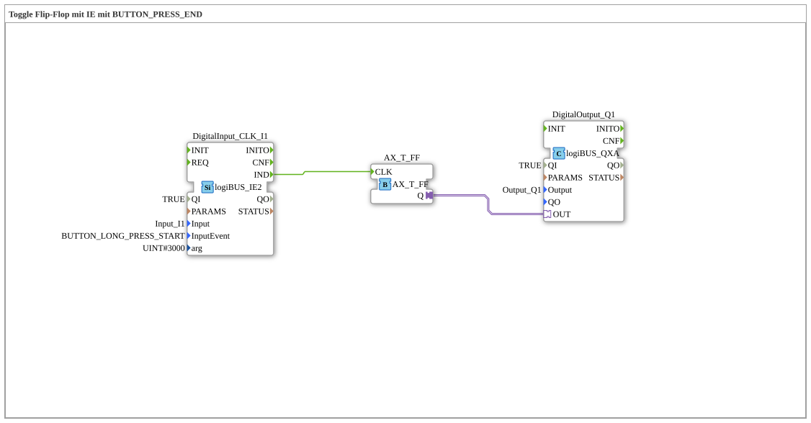

# Exercise_004c7_AX: Toggle Flip-Flop with IE using BUTTON_PRESS_END

[(https://notebooklm.google.com/notebook/041f4df4-b729-484d-b786-b6dcdf151961)
This article describes the logiBUS® exercise `Uebung_004c7_AX`. Here, `logiBUS_IE2` is also used to adjust the duration for a "long press"
----

## Objective of the Exercise

Definition of a specific hold time.

-----

## Description and Components

[cite_start]The subapplication `Uebung_004c7_AX.SUB` uses `logiBUS_IE2` with `InputEvent = BUTTON_LONG_PRESS_START` and `arg = 3000` [ms](cite: 1).

-----

## Functionality

The event only fires when the button is held down for **3 seconds** (3000 ms). This overrides the default value (which is usually 500 ms or 1 second).

----

## Application Example

**Load factory settings**: A highly destructive action that must be extremely well protected against accidental triggering. The user must consciously press and hold the button.
