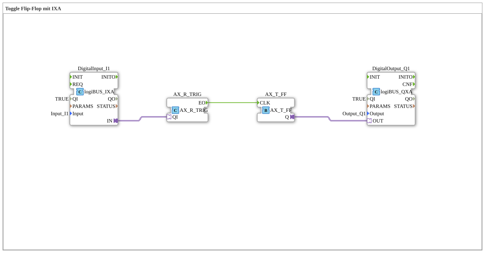

# Exercise_005_AX: Toggle Flip-Flop with IXA

This article describes the logiBUS® exercise `Uebung_005_AX`. This exercise demonstrates how to use a state-based input (`IXA`) to control an event-based flip-flop.

----

## Objective of the Exercise

Demonstration of converting data to events for control purposes.

-----

## Description and Components

[cite_start]The subapplication `Uebung_005_AX.SUB` uses a standard digital input (`logiBUS_IXA`) instead of an event input (`logiBUS_IE`)[cite: 1].

### Function Blocks (FBs)

* **`DigitalInput_I1`**: Type `logiBUS_IXA`. Continuously returns TRUE when pressed.

* **`AX_SWITCH`**: Serves as a gate here.

* **`AX_T_FF`**: The toggle flip-flop.

-----

## Functionality

The circuit utilizes the fact that `IXA` also sends an adapter event with every change.

1. When `I1` is pressed (FALSE -> TRUE), the adapter sends an event and `D1=TRUE`.

2. The `AX_SWITCH` receives the event. Since `G` (connected to `I1.IN`) is now TRUE, it forwards the event to `EO1`.

3. `EO1` triggers the flip-flop -> the light switches.

4. When `I1` is released (TRUE -> FALSE), the adapter sends another event, this time to `D1=FALSE`.

5. `AX_SWITCH` forwards the event to `EO0` (currently unconnected). The flip-flop is not triggered.

... The result is correct edge detection (switching only occurs on a rising edge).

-----

## Evaluation

This is a valid method if you only have `IXA` function blocks available and cannot or do not want to use `IE`. However, it is more resource-intensive than using the specialized `IE` function block with the `SINGLE_CLICK` event.