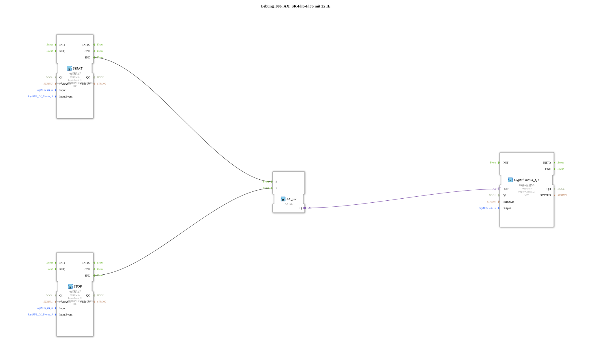

# Exercise_006_AX: SR Flip-Flop with 2x IE

This article describes the logiBUS® exercise `Uebung_006_AX`. Here, the classic RS gate (memory gate) is implemented.

----

## Objective of the Exercise

Implementation of a circuit with separate pushbuttons for "On" and "Off".

-----

## Description and Components

[cite_start]The sub-application `Uebung_006_AX.SUB` uses two pushbuttons and one `AX_SR` block[cite: 1].

### Function Blocks (FBs)

* **`I1` (Set)**: Push button to turn on.

* **`I2` (Reset)**: Push button to turn off.

* **`AX_SR`**: An SR flip-flop (Set is dominant if simultaneous, but separated here by events).

-----

## Functionality

* A click on `I1` sends an event to `S` -> output `Q` becomes TRUE.

* * A click on `I2` sends an event to `R` -> output `Q` becomes FALSE.

* Repeatedly pressing `I1` has no effect if it is already on.

-----

## Application Example

**Machine Control**: A green button starts the motor, a red button stops it. This is safer than a toggle switch, as the operator can always press a defined "Off" position.