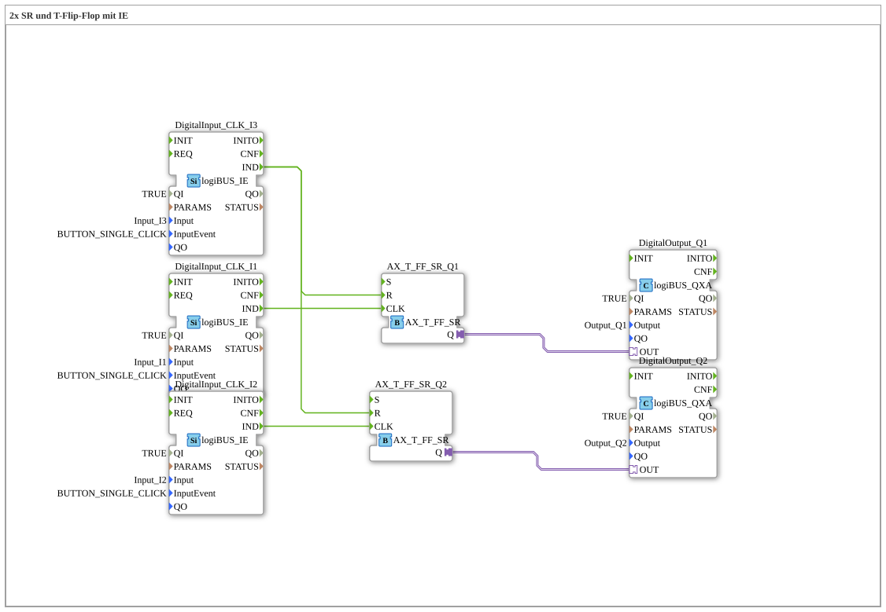

# Exercise_006a2_AX: 2x SR and T Flip-Flop with IE

This article describes the logiBUS® exercise `Uebung_006a2_AX`.

----

## Objective of the Exercise

Demonstration of a central off function.

-----

## Description and Components

[cite_start]The subapplication `Uebung_006a2_AX.SUB` controls two independent lamps that can be switched off together[cite: 1].

### Function Blocks (FBs)

* **`I1`**: Toggles lamp 1.

* **`I2`**: Toggles lamp 2.

* **`I3`**: Resets both.

* **2x `AX_T_FF_SR`**: One for each lamp.

-----

## Functionality

* `I1` is connected to `CLK` of FF1.

* `I2` is connected to `CLK` of FF2.

* `I3` is connected to `R` of **both** flip-flops (fan-out).

Pressing `I3` immediately turns off both lamps, regardless of their previous state.

-----

## Application Example

**Office Lighting**: Each desk has its own light (`I1`, `I2`), but there is an "Exit" switch at the exit that turns everything off (`I3`).