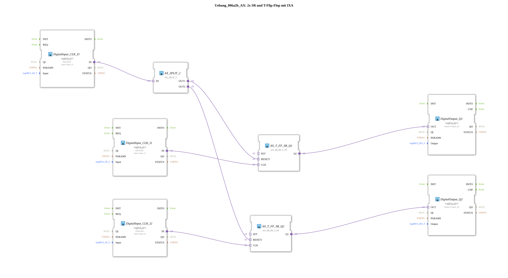

# Exercise_006a2b_AX: 2x SR and T Flip-Flop with IXA
<!-- Hier könnte ein Bild eingefügt werden, falls vorhanden. -->

* * * * * * * * * *
## Introduction
This exercise demonstrates the application of SR and T flip-flops in combination with a common reset signal ("janitor off").

Two digital inputs (`I1`, `I2`) toggle the two outputs (`Q1`, `Q2`). A third input (`I3`) resets both outputs simultaneously.

This illustrates the interaction of bistable elements and event distribution in 4diac.

## Function Blocks (FBs) Used

#### Sub-Blocks

#### DigitalInput_CLK_I1
- **Type**: `logiBUS::io::DI::logiBUS_IXA`
- **Parameters**: `Input = Input_I1`, `QI = TRUE`
- **Function**: Provides the digital push-button input I1 as an event. Each press generates an event at output `IN`.

#### DigitalInput_CLK_I2
- **Type**: `logiBUS::io::DI::logiBUS_IXA`
- **Parameters**: `Input = Input_I2`, `QI = TRUE`
- **Function**: Provides the digital button input I2 as an event.

#### DigitalInput_CLK_I3
- **Type**: `logiBUS::io::DI::logiBUS_IXA`
- **Parameters**: `Input = Input_I3`, `QI = TRUE`
- **Function**: Provides the digital button input I3 (reset button) as an event.

#### AX_SPLIT_2
- **Type**: `adapter::events::unidirectional::AX_SPLIT_2`
- **Function**: Distributes an incoming event (from I3) to two outputs (`OUT1`, `OUT2`). This allows a single button signal to be sent to multiple receivers simultaneously.

#### AX_T_FF_SR_Q1
- **Type**: `adapter::bistableElements::AX_FB_RS_T_FF`
- **Function**: Combined RS and T flip-flop.
- At the event input `CLK` (connected to I1), the output `Q1` is toggled on each rising edge.
- The event input `RESET1` (connected to `AX_SPLIT_2.OUT1`) resets the output `Q1`.

#### AX_T_FF_SR_Q2
- **Type**: `adapter::bistableElements::AX_FB_RS_T_FF`
- **Function**: Similar flip-flop to the one above.
- `CLK` from I2, `RESET1` from `AX_SPLIT_2.OUT2`.
- Controls the output `Q2`.

#### DigitalOutput_Q1
- **Type**: `logiBUS::io::DQ::logiBUS_QXA`
- **Parameters**: `Output = Output_Q1`, `QI = TRUE`
- **Function**: Digital output that outputs the state of `Q1` to the physical output `Output_Q1`.

#### DigitalOutput_Q2
- **Type**: `logiBUS::io::DQ::logiBUS_QXA`
- **Parameters**: `Output = Output_Q2`, `QI = TRUE`
- **Function**: Digital output that outputs the state of `Q2` to the physical output `Output_Q2`.

## Program Flow and Connections

The circuit operates according to the following principle:

1. **T-Flip-Flop Operation**:

Each press of button I1 generates an event at the `CLK` input of `AX_T_FF_SR_Q1`. The flip-flop toggles its output state. The same applies to button I2 and `AX_T_FF_SR_Q2`.

2. **Central Reset ("Janitor Off")**:

When button I3 is pressed, the event is distributed via the splitter `AX_SPLIT_2` to the `RESET1` inputs of both flip-flops. Both outputs (`Q1`, `Q2`) are immediately reset.

3. **Output**:

The internal states of `Q1` and `Q2` are output via the digital outputs `Output_Q1` and `Output_Q2`.

**Learning Objectives**:

- Understanding the behavior of T flip-flops and RS flip-flops.
- Event-based programming and routing with `AX_SPLIT_2`.
- Simple interaction of digital inputs and outputs.

**Prerequisites**:

- Basic knowledge of the 4diac IDE and event-driven control according to IEC 61499.

**Execution**:

The exercise can be started directly in a 4diac runtime environment (e.g., FORTE) with appropriately configured logiBUS I/O modules. Buttons I1 and I2 switch the outputs, and button I3 resets everything.

## Summary

The exercise "Exercise_006a2b_AX" implements two independent T flip-flops that share a common reset input.

Using the adapter function blocks `AX_FB_RS_T_FF` and `AX_SPLIT_2` results in a compact and easily understandable control system.

The focus is on understanding bistable circuits and event-driven communication in 4diac.

---

### 🌐 Related topic subpages on ms-muc-docs.de
* [🌐 Eclipse 4diac IDE & Color Reference on ms-muc-docs.de](https://www.ms-muc-docs.de/iec-61499/eclipse-4diac/)

]
