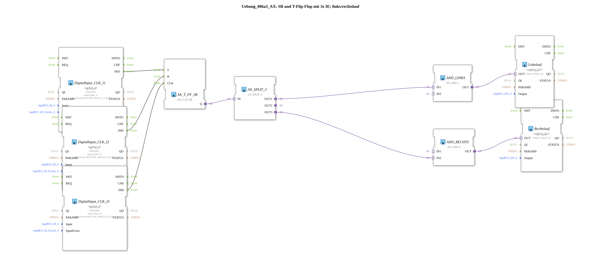

# Exercise_006a3_AX: SR and T Flip-Flop with 3x IE; forward/reverse rotation

This article describes the logiBUS® exercise `Uebung_006a3_AX`. This is a more complex application for controlling a motor with two directions of rotation.

----

## Objective of the exercise

Implementation of a reversing contactor control with software interlock. "Left" and "Right" must never be controlled simultaneously, as this would cause a short circuit in the power circuit.

-----

## Description and Components

[cite_start]The subapplication `Uebung_006a3_AX.SUB` uses a combination of a flip-flop, a splitter, and a custom sub-application (`Uebung_006a3_sub_AX`)[cite: 1].

### Function Blocks (FBs)

* **`I1` (Set)**: Turn on (in the last selected direction or default).

* **`I2` (Reset)**: Turn off.

* **`I3` (Toggle)**: Start/Stop.

* **`AX_T_FF_SR`**: Main memory "Motor On/Off".

* **`AX_SPLIT_3`**: Distributes the "Motor is on" signal.

* **`AX_LinksRechts_T_FF` (SubApp)**: Stores the current *direction* (left or right).

* **2x `AX_AND_2`**: Interlock gate.

-----

## Functionality

1. The `AX_T_FF_SR` determines whether the motor should run at all.

2. The subapp `AX_LinksRechts_T_FF` is a direction memory (toggle). Every time the motor is switched on (event from `SPLIT_3.OUT1`), this subapp toggles the direction for the *next* or *current* run (depending on the exact internal wiring).

3. The AND gates connect "Motor On" (`SPLIT_3`) to "Direction Left" or "Direction Right".

4. This ensures that only one output (`Q1` or `Q2`) is active at any given time.

*Note: The exact logic for changing the direction (at every start? or via a separate button?) depends on `Uebung_006a3_sub_AX`.*

-----

## Application Example

**Washing machine** or **mixer**: The motor should run alternately left and right, but never simultaneously.