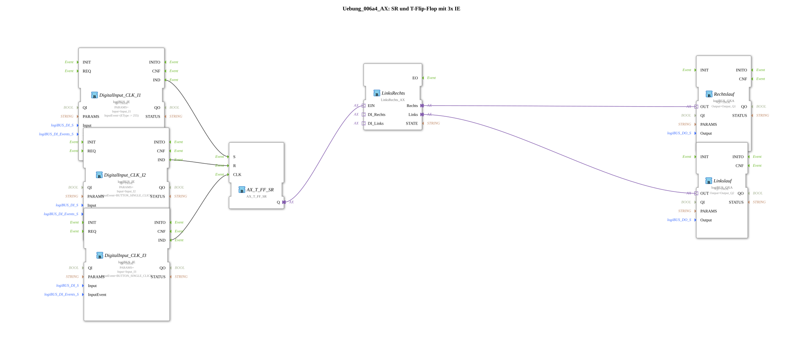

# Exercise_006a4_AX: SR and T Flip-Flop with 3x IE

[(https://notebooklm.google.com/notebook/041f4df4-b729-484d-b786-b6dcdf151961)
This article describes the logiBUS® exercise `Uebung_006a4_AX`. It is an optimization of `Uebung_006a3_AX` using a pre-built module.
----
## Objective of the Exercise

Using libraries ("Don't reinvent the wheel").

-----

## Description and Components

[cite_start]The subapplication `Uebung_006a4_AX.SUB` replaces the complex network of gates and subapplication from the previous exercise with the module `LinksRechts_AX`[cite: 1].

### Function Blocks (FBs)

- **`LinksRechts`**: Type `logiBUS::utils::sequence::verteiler::LinksRechts_AX`. This block encapsulates the complete logic for direction control and interlocking.
- **`AX_T_FF_SR`**: Continues to supply the "On/Off" signal to input `EIN` of the distributor.

-----

## Functionality

The logic is encapsulated. The block `LinksRechts_AX` internally manages to alternately route the input signal to outputs `Links` and `Rechts`.

-----

## Advantage

The code is significantly cleaner, more readable, and less prone to errors.
