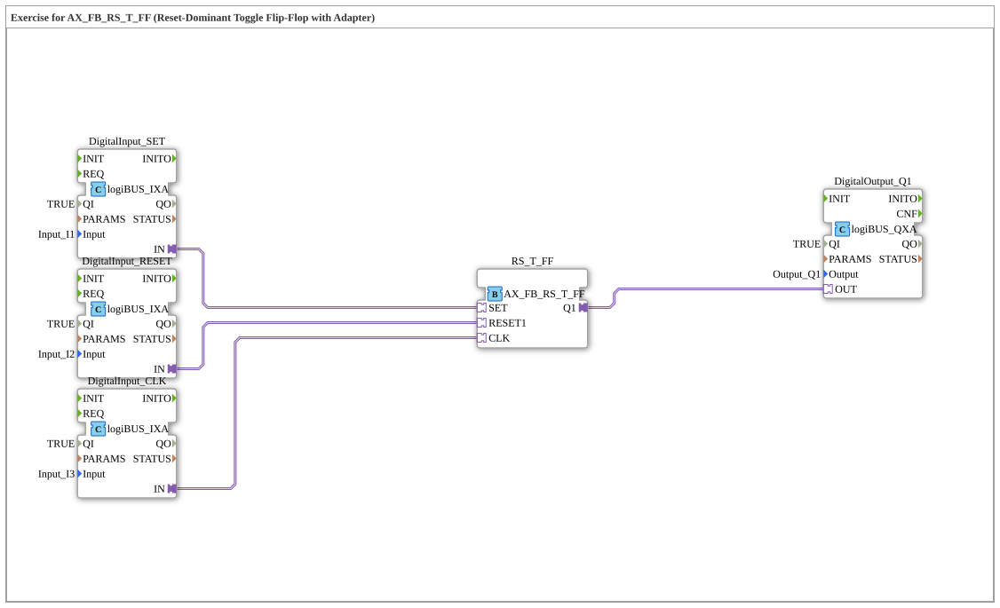

# Exercise_006a4_AX_RS: Exercise for AX_FB_RS_T_FF (Reset-Dominant Toggle Flip-Flop with Adapter)



* * * * * * * * * *
## Introduction
This exercise demonstrates the use of the **Reset-Dominant Toggle Flip-Flop (AX_FB_RS_T_FF)** with an adapter interface in the 4diac IDE.

The flip-flop has three inputs (SET, RESET1, CLK) and one output (Q1). The circuit is controlled via digital logiBUS inputs (Input_I1 as SET, Input_I2 as RESET, Input_I3 as clock). The output signal is connected to the logiBUS output Output_Q1.

The goal is to understand the behavior of a **reset-dominant** toggle flip-flop and to replicate the wiring with adapter FBs.


## Function Blocks (FBs) Used

- **DigitalInput_SET** (Type: `logiBUS_IXA`): Reads the logiBUS input `Input_I1` (SET signal).

- **DigitalInput_RESET** (Type: `logiBUS_IXA`): Reads the logiBUS input `Input_I2` (RESET signal).

- **DigitalInput_CLK** (Type: `logiBUS_IXA`): Reads the logiBUS input `Input_I3` (Clock signal).

- **RS_T_FF** (Type: `AX_FB_RS_T_FF`): Reset-dominant toggle flip-flop with adapter interface.

- **DigitalOutput_Q1** (Type: `logiBUS_QXA`): Outputs the flip-flop state to the logiBUS output `Output_Q1`.

### Parameter

| FB | Parameter | Value |

|----|-----------|------|

| DigitalInput_SET | `QI` | `TRUE` |

| DigitalInput_SET | `Input` | `Input_I1` |

| DigitalInput_RESET | `QI` | `TRUE` |

| DigitalInput_RESET | `Input` | `Input_I2` |
| DigitalInput_CLK | `QI` | `TRUE` |
| DigitalInput_CLK | `Input` | `Input_I3` |
| DigitalOutput_Q1 | `QI` | `TRUE` |
| DigitalOutput_Q1 | `Output` | `Output_Q1` |

## Program Flow and Connections

The logiBUS inputs are read via the function blocks `DigitalInput_SET`, `DigitalInput_RESET`, and `DigitalInput_CLK` and passed on as adapter sockets to the flip-flop `RS_T_FF`.


``` **Connections (Adapter Connections):**

- `DigitalInput_SET.IN` → `RS_T_FF.SET`
- `DigitalInput_RESET.IN` → `RS_T_FF.RESET1`
- `DigitalInput_CLK.IN` → `RS_T_FF.CLK`
- `RS_T_FF.Q1` → `DigitalOutput_Q1.OUT`

**Flip-Flop Functionality:**
- On a rising edge at the CLK input, output Q1 toggles (i.e., it changes its state from FALSE to TRUE or vice versa).

- If the RESET1 input is active (TRUE), the output is **immediately and dominantly** set to FALSE – regardless of the current state and the clock signal.


**Flip-Flop Functionality:**

- On a rising edge at the CLK input, output Q1 toggles (i.e., it changes its state from FALSE to TRUE or vice versa). - The SET input sets the output to TRUE if no RESET signal is present and no clock pulse is being executed. Since RESET is dominant, RESET always takes precedence.

**Learning Objectives:**

- Understanding the functionality of a reset-dominant toggle flip-flop.

- Working with adapter-based function blocks in 4diac.

- Integrating logiBUS hardware inputs/outputs into an automation project.

**Difficulty Level:** Medium
**Prerequisites:** Basic knowledge of flip-flops and the 4diac IDE.

## Summary
Exercise `Uebung_006a4_AX_RS` implements a reset-dominant toggle flip-flop with three logiBUS inputs and one output. The flip-flop's adapter interface provides a clear, functional connection between the hardware inputs/outputs and the function block's logic. The dominant RESET function ensures reliable basic behavior in control applications.

---

### 🌐 Related topic subpages on ms-muc-docs.de

* [🌐 Eclipse 4diac IDE & Color Reference on ms-muc-docs.de](https://www.ms-muc-docs.de/iec-61499/eclipse-4diac/)

]