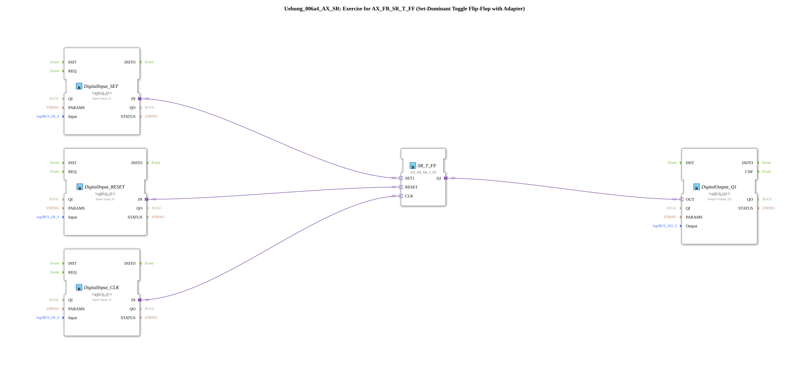

# Exercise_006a4_AX_SR: Exercise for AX_FB_SR_T_FF (Set-Dominant Toggle Flip-Flop with Adapter)

* * * * * * * * * *
## Introduction
This exercise introduces the function block `AX_FB_SR_T_FF` (Set-Dominant Toggle Flip-Flop), which is connected via an adapter. The goal is to understand the behavior of a set-dominant toggle flip-flop and to test it in a simple controller.
The block is connected with three digital inputs (SET, RESET, CLK) and one digital output (Q1). By connecting it to the logiBUS input/output blocks, the circuit can be tested directly on real hardware.

## Function Blocks (FBs) Used

The following function blocks are used in this exercise:

| FB Name | Type | Parameters |
|---------|-----|-----------|
| `DigitalInput_SET` | `logiBUS::io::DI::logiBUS_IXA` | Input = `Input_I1` |
| `DigitalInput_RESET` | `logiBUS::io::DI::logiBUS_IXA` | Input = `Input_I2` |
| `DigitalInput_CLK` | `logiBUS::io::DI::logiBUS_IXA` | Input = `Input_I3` |
| `SR_T_FF` | `adapter::bistableElements::AX_FB_SR_T_FF` | (no parameters) |
| `DigitalOutput_Q1` | `logiBUS::io::DQ::logiBUS_QXA` | Output = `Output_Q1` |

- **`logiBUS_IXA`**: Digital input that feeds the signal from a logiBUS input channel via the adapter.
- **`AX_FB_SR_T_FF`**: Set-dominant toggle flip-flop with the adapter interfaces `SET1`, `RESET`, and `CLK`. The output `Q1` toggles on every rising edge at the clock input when **SET** is active; when **RESET** is active, the output is reset.
- **`logiBUS_QXA`**: Digital output that forwards the signal to a logiBUS output channel.

No further sub-applications (`SubAppType`) are used within the network.

## Program Flow and Connections

The logical flow of the exercise is as follows:

1. **Inputs**: The physical inputs `Input_I1` (SET), `Input_I2` (RESET), and `Input_I3` (CLK) are read into the 4diac environment via the three `logiBUS_IXA` function blocks.

2. **Flip-Flop**: The signals are routed via adapter connections to `SR_T_FF`:

- `DigitalInput_SET.IN` → `SR_T_FF.SET1`
- `DigitalInput_RESET.IN` → `SR_T_FF.RESET`
- `DigitalInput_CLK.IN` → `SR_T_FF.CLK`

3. **Output**: The output `SR_T_FF.Q1` is transferred to the digital output `DigitalOutput_Q1.OUT` and output to `Output_Q1`.

**How the SR_T_FF Works**:

- When **Reset** (`RESET = 1`) is active, the output is immediately set to `FALSE`.
- If **Reset** is inactive and **SET** is active, the output toggles on every rising edge at `CLK`. (Set-dominant means that a simultaneously active Set allows the toggle function; if Set is inactive, the output is not toggled.)
- If both Set and Reset are inactive, the output remains unchanged.

**Learning Objectives**:

- Understanding the set-dominant toggle flip-flop and its adapter interface.
- Integration of hardware inputs/outputs via logiBUS adapters.
- Analysis of the timing behavior with different input combinations.

**Difficulty Level**: Easy

**Prerequisites**: Basic familiarity with the 4diac IDE, basic digital logic.

## Summary

The exercise `Uebung_006a4_AX_SR` demonstrates the use of the set-dominant toggle flip-flop `AX_FB_SR_T_FF` in a 4diac environment. The clear separation of input/output adapters and the actual flip-flop component enables low-level control that can be tested directly on a logiBUS platform. The focus is on understanding the toggle function, taking into account the dominant set and reset behavior.

--

### 🌐 Related topic subpages on ms-muc-docs.de
* [🌐 Eclipse 4diac IDE & color reference on ms-muc-docs.de ](https://www.ms-muc-docs.de/iec-61499/eclipse-4diac/)

]
