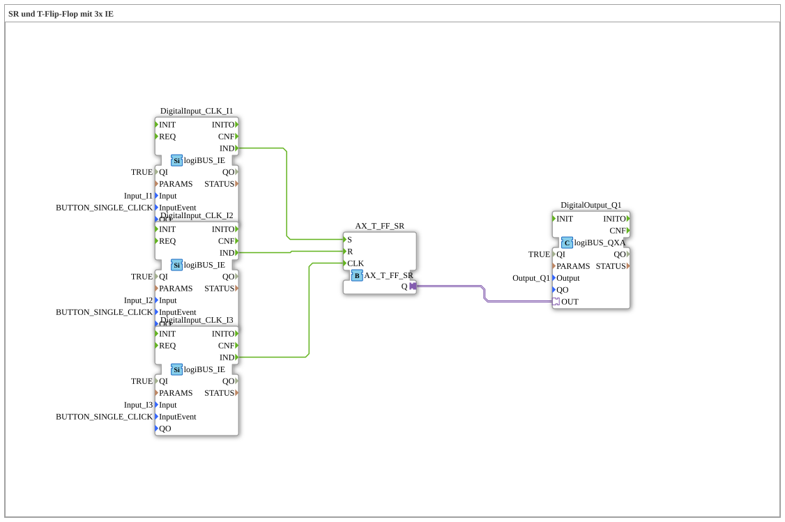

# Exercise_006a_AX: SR and T Flip-Flop with 3x IE

[(https://notebooklm.google.com/notebook/041f4df4-b729-484d-b786-b6dcdf151961)
This article describes the logiBUS® exercise `Uebung_006a_AX`. This exercise demonstrates a versatile component
----

## Objective of the Exercise

To become familiar with `AX_T_FF_SR`.

-----

## Description and Components

[cite_start]The subapplication `Uebung_006a_AX.SUB` uses three pushbuttons[cite: 1].

### Function Blocks (FBs)

- **`I1` (Set)**
- **`I2` (Reset)**
- **`I3` (Toggle)**
- **`AX_T_FF_SR`**: Combines Toggle, Set, and Reset in one block.

-----

## Functionality

- `I1` switches on.
- `I2` switches off.
- `I3` toggles.

This offers maximum flexibility for operation.

-----

## Application Example

**Smart Home Lighting Control**:

- Wall switch: Toggle (`I3`).
- Central "All Off" when leaving the house: Reset (`I2`).
- "Panic light" (alarm system): Set (`I1`).
