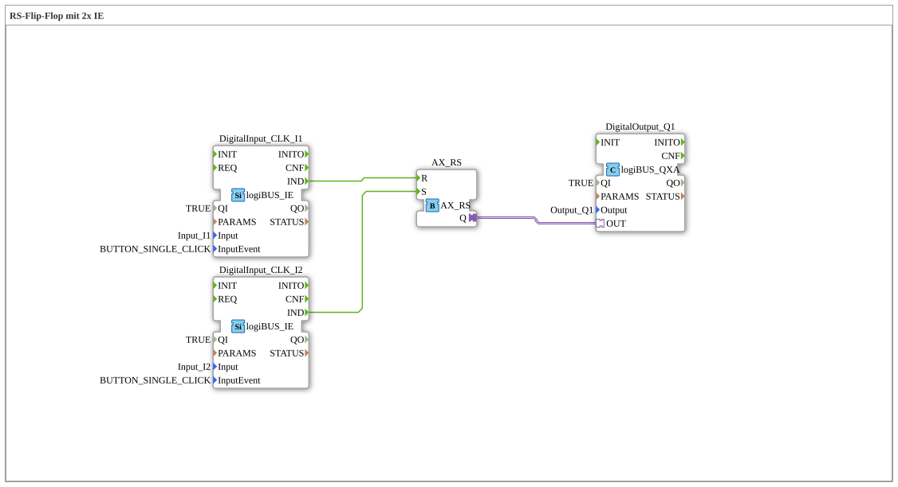

# Exercise_006b_AX: RS Flip-Flop with 2x IE

[(https://notebooklm.google.com/notebook/041f4df4-b729-484d-b786-b6dcdf151961)
This article describes the logiBUS® exercise `Uebung_006b_AX`.
----
## Objective of the Exercise

Understand the difference between SR (Set Priority) and RS (Reset Priority).

-----

## Description and Components

[cite_start]The subapplication `Uebung_006b_AX.SUB` uses a `AX_RS` function block[cite: 1].

### Function Blocks (FBs)

- **`AX_RS`**: An RS flip-flop.

-----

## Functionality

Functionally very similar to `AX_SR`. The difference lies in the behavior when a set and a reset event arrive **simultaneously** (in the same PLC cycle) (or when both inputs are TRUE for level-controlled function blocks).

- **SR**: Set takes precedence -> output becomes TRUE.
- **RS**: Reset takes precedence -> output becomes FALSE.

In IEC 61499 with event processing, "simultaneity" is more subtle, as events are often processed sequentially. However, if, for example, both events arrive in the same "step" via a `E_SPLIT`, the function block's internal logic decides. With `AX_RS`, the reset event takes precedence in case of doubt.

- **RS**: Reset takes precedence -> output becomes FALSE. -----

## Application Example

**Safety-Critical Shutdown**: If someone presses "Start" while "Emergency Stop" is pressed, the machine **must not** start. Therefore, Reset Dominance (RS) is required.
