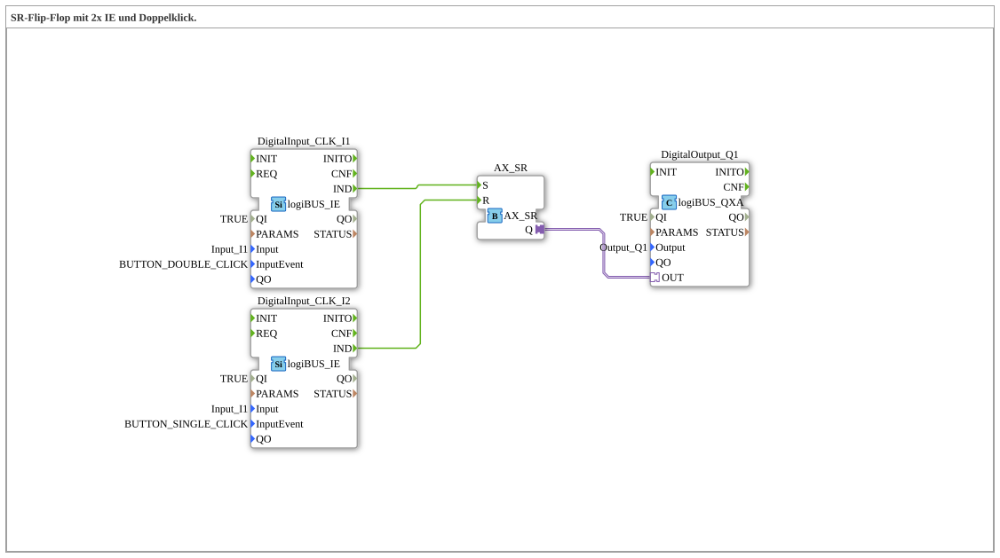

# Exercise_006d_AX: SR Flip-Flop with 2x IE and Double-Click.

[(https://notebooklm.google.com/notebook/041f4df4-b729-484d-b786-b6dcdf151961)
This article describes the logiBUS® exercise `Uebung_006d_AX`.
----
## Objective of the Exercise

Combining input events and memory elements.

-----

## Description and Components

[cite_start]The subapplication `Uebung_006d_AX.SUB` defines an asymmetric operation[cite: 1].

### Function Blocks (FBs)

* **`I1` (Set)**: Configured on `BUTTON_DOUBLE_CLICK`.
* **`I2` (Reset)**: Configured to `BUTTON_SINGLE_CLICK`.
* **`AX_SR`**: Memory.

----

## Functionality

* To **turn on**, the button `I1` must be **double-clicked**.
* To **turn off**, a **single** click on `I2` is sufficient.

-----

## Application Example

**Protection against accidental activation**: A device (e.g., a pump) that could be dangerous or consumes a lot of energy should not start due to accidental touching of the switch. The double-click requires a conscious action ("Yes, I really want to"). Turning it off, on the other hand, must be quick and easy in an emergency (single click).