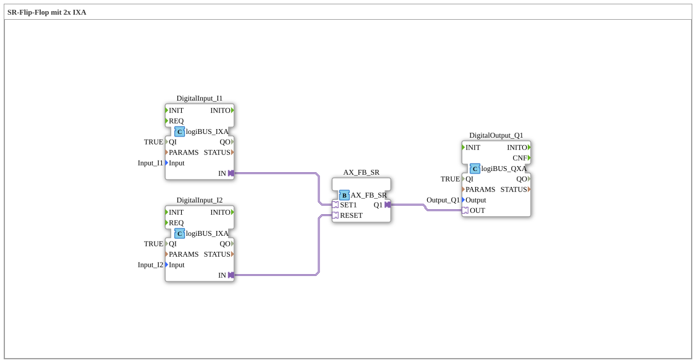

Here is the documentation for exercise `Uebung_006e1_AX` based on the provided data.
# Exercise_006e1_AX: SR Flip-Flop with 2x IXA

* * * * * * * * * *
## Introduction
This exercise implements an **SR flip-flop** (bistable flip-flop) using **adapter technology** (AX/IX/QX). The logic is used to set a digital output via one input and reset it via a second input. Using adapters bundles data and event flows into individual connections, improving clarity in the schematic.

## Function Blocks (FBs) Used

This sub-application uses specific function blocks for input and output via the logiBUS, as well as a logic block for the flip-flop.

### Sub-Blocks: Exercise_006e1_AX

Here are the internal function blocks that are interconnected in this network:

- **Type**: SubAppType
- **Internal FBs Used**:
- **DigitalInput_I1**: `logiBUS::io::DI::logiBUS_IXA`
- **Parameters**:
- `Input` = "Input_I1"
- `QI` = TRUE (visible: false)
- **Description**: This block represents the first digital input (set). It uses an adapter output (`IN`) to pass the state to the logic.
- **DigitalInput_I2**: `logiBUS::io::DI::logiBUS_IXA`
- **Parameters**:
- `Input` = "Input_I2"
- `QI` = TRUE (visible: false)
- **Description**: This function block represents the second digital input (reset). It also uses an adapter output (`IN`).
- **DigitalOutput_Q1**: `logiBUS::io::DQ::logiBUS_QXA`
- **Parameters**:
- `Output` = "Output_Q1"
- `QI` = TRUE (visible: false)
- **Description**: This function block represents the digital output. It receives signals via an adapter input (`OUT`).
- **AX_FB_SR**: `adapter::iec61131::bistableElements::AX_FB_SR`
- **Description**: This is the core logic block. It is an SR flip-flop specifically designed for use with adapters. It has adapter inputs for `SET1` and `RESET`, as well as an adapter output for `Q1`.

## Program Flow and Connections

The network implements a memory function using an SR flip-flop. The process and adapter connections are as follows:

1. **Set:**

* The adapter output `IN` of **DigitalInput_I1** is connected to the adapter input `SET1` of the **AX_FB_SR** module.
* When `Input_I1` is active, the flip-flop is set.

2. **Reset:**

* The adapter output `IN` of **DigitalInput_I2** is connected to the adapter input `RESET` of the **AX_FB_SR** module.
* When `Input_I2` is active, the flip-flop is reset.

3. **Output:**

* The adapter output `Q1` of the **AX_FB_SR** block is connected to the adapter input `OUT` of **DigitalOutput_Q1**.
* The flip-flop status is passed directly to the physical output `Output_Q1`.

**Special feature of the adapters:**
Instead of using separate event and data lines, adapter connections (represented by the double arrows/wider lines in the IDE) are used. This drastically reduces the number of visible lines.

* **Logical Behavior (SR Dominance):**
Since this is an SR component, the following typically applies: If only set is active, the output is

1. If only reset is active, the output is

0. If both inputs are active simultaneously, the component type determines the dominance (for SR components according to IEC 61131, set often takes precedence, but this is implementation-dependent, as specified in `AX_FB_SR`).

## Summary

Exercise `Uebung_006e1_AX` efficiently demonstrates the use of adapter technology to implement a classic memory function (SR flip-flop). The connection to the hardware is abstracted by using `logiBUS_IXA` and `logiBUS_QXA`, while `AX_FB_SR` handles the logical operation.
